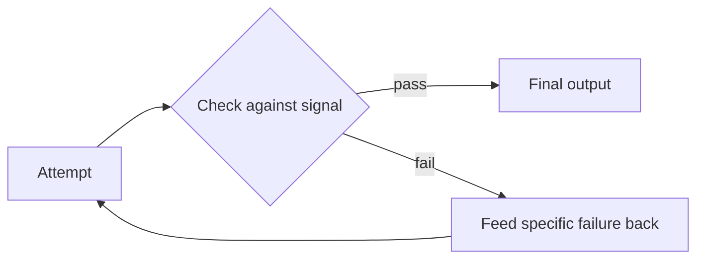

# Reliability and Recovery — Middle

<!-- level-focus -->
At middle level, focus on this question:

> For a task where the first attempt often fails, can you add a reflection/self-correction step that checks the output against an objective signal, cap retries with a controlled failure path, and measure — with real before/after numbers — whether it actually improved reliability?

---

## What reflection actually is

- Reflection: after a step produces an output, a separate check evaluates whether that output is actually correct or acceptable, before it's treated as final — and if it isn't, the failure is fed back so the step can try again with that specific feedback.
- This is different from just retrying blindly (junior level) — reflection specifically tells the retry *what was wrong*, so the next attempt has a real chance of being different, not just a repeat.

## Objective signals beat subjective ones

- The check in a reflection loop needs a signal that's actually checkable — not "does this look right," which the same model that produced the output can't reliably judge about itself.
- Good objective signals: does the generated SQL query actually execute without a syntax error, does the generated code pass a test, does a required field exist in the structured output, does a numeric total match an independently computed value.
- Weak signal: asking the model "are you confident this is correct?" — self-reported confidence isn't a reliable check on its own output.

## Concrete example: natural-language-to-SQL

1. Model generates a SQL query from a natural-language question.
2. **Objective check**: actually attempt to execute the query (against a read replica, never production directly) — a syntax error is a hard, checkable signal.
3. If it fails, feed the exact database error message back as the new observation — not just "try again" — so the next attempt has the specific reason to correct.
4. Cap retries (next section) so a persistently wrong query doesn't loop forever.

## Capping retries and failing controlled

- Every reflection loop needs a max-retry cap, same principle as the stopping conditions from Workflow Fundamentals.
- On exceeding the cap, fail in a defined, controlled way: return a clear "couldn't complete this" message, or escalate to a human — never let the loop silently keep trying past the cap, and never let it silently return the last (still-wrong) attempt as if it succeeded.

## Distinguishing transient failures from logical failures in a reflection loop

- A reflection loop's failed check might be transient (the query failed because of a momentary connection issue, unrelated to the query's correctness) or logical (the query itself has wrong column names).
- Only feed genuinely logical failures back as "here's what to fix" — a transient failure should just retry the same attempt, not treat it as something the model got wrong.

## Measuring whether reflection actually helps

- Before shipping a reflection loop, measure baseline reliability without it (what % of first attempts succeed) and reliability with it (what % succeed within the retry cap) on a real, representative sample — not a handful of hand-picked easy cases.
- If reflection doesn't measurably improve the success rate for real cost (added latency, added model calls), it's not earning its complexity — the objective check itself might be too weak, or first-attempt failures might mostly be a different, unrelated problem that reflection can't fix.

## Cross-Component Scenario

The support workflow's refund-policy sub-agent (from Orchestration and Delegation) sometimes misclassifies whether a stated reason matches a policy exception.

1. Add an objective check: does the sub-agent's structured output actually cite one of the enumerated policy clause IDs, or an invalid/nonexistent one?
2. On an invalid citation, feed back "the clause ID you cited doesn't exist; valid clause IDs are: [list]" as the new observation.
3. Cap at 2 retries; on the third failure, escalate the case to a human reviewer instead of guessing.
4. Measure: before this check, what fraction of cases had an invalid clause ID reach the final answer? After, what fraction get caught and corrected within the retry cap?

## Common Mistakes

- **Using the model's own self-reported confidence as the reflection signal.** A model expressing confidence isn't a check independent of the thing being checked — it can be confidently wrong.
- **No retry cap on a reflection loop.** A persistently wrong output can loop indefinitely, burning cost with no guarantee of eventually succeeding.
- **Feeding back a vague "try again" instead of the specific failure.** Without the specific reason, the next attempt has no more information than the first one did, and is likely to repeat the same mistake.
- **Shipping reflection without measuring its actual before/after effect.** A reflection loop that adds cost and latency without a measured reliability gain is complexity that isn't earning its keep.

## Apply It

1. For a step in your workflow that sometimes produces a wrong output, identify an objective, checkable signal for correctness.
2. Design the specific feedback fed back on failure — not "try again," but the actual reason.
3. Set a retry cap and write the controlled failure/escalation path for when it's exceeded.
4. Measure baseline success rate without reflection and success-within-cap rate with it, on a real sample.

## Verify Your Work

- The check uses an objective signal (execution, test pass, field presence) — not the model's self-assessment.
- Failed attempts are fed back with the specific reason, not a generic retry prompt.
- The retry cap has a defined, controlled failure path, not a silent loop or silent acceptance of a wrong result.
- You have actual before/after numbers, not an assumption that reflection helps.

## Review Questions

- Why is a model's self-reported confidence a weak signal for a reflection check?
- What's the difference between feeding back a specific failure reason and just saying "try again," and why does it matter?
- What should happen when a reflection loop exceeds its retry cap?
- Why measure reflection's actual effect on success rate instead of assuming it helps?
