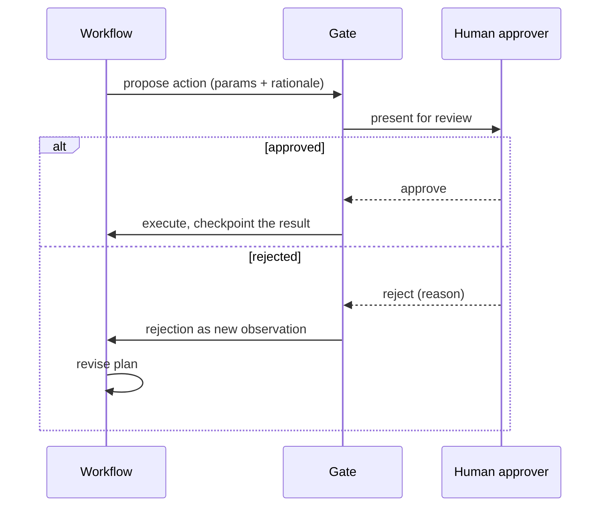

# Reliability and Recovery — Senior

<!-- level-focus -->
At senior level, focus on this question:

> For a high-stakes step in your workflow — issuing a refund, sending an external email, modifying production data — how do you design a human-in-the-loop approval gate that actually reduces risk without turning every run into a bottleneck that defeats the point of automation?

---

## Risk tiers, not a single gate-or-no-gate decision

Not every step carries the same risk. Treating them all the same — gate everything, or gate nothing — is wrong in both directions.

| Tier | Example | Gate needed? |
|---|---|---|
| Read-only / fully reversible | Look up an order, search a knowledge base | No gate — nothing changes state |
| Write, low value, easily reversible | Update a stated contact preference | No pre-action gate; post-hoc audit log is enough |
| Write, hard to reverse or meaningful value | Issue a refund, change a shipping address on an order in transit | Pre-action approval gate required |
| Destructive/irreversible, high value or blast radius | A large refund, direct production data change, a legally binding communication | Mandatory approval, possibly dual control |

- The tier is a judgment call about reversibility, financial/legal exposure, and blast radius — not how "risky-sounding" the step's name is. A $8 refund and an $8,000 refund are the same tool call with very different risk, which is why gating keys off the call's actual parameters, not just which tool it is.

## What an approval gate actually does

A gate is a specific interruption in the workflow, not "ask a human to look at the ticket":

1. The workflow **proposes**, it doesn't execute — the action is emitted with full parameters and rationale, intercepted before the real tool call runs.
2. A human reviews the **specific proposal** (parameters + rationale), not the whole run history, so they can approve or reject in seconds.
3. On approval, the gate executes the tool call and writes the durable checkpoint (see State, Memory, and Durability) — the human authorizes; the gate executes.
4. On rejection, the reason feeds back as a new observation, exactly like a failed step (junior level), so the workflow can revise rather than dead-end.

## Balancing autonomy against risk

| Factor | Stricter gating | Looser gating |
|---|---|---|
| Reversibility | Hard or impossible to undo | Easily reversed, no lasting cost |
| Financial/legal exposure | High value, contractual, regulatory | Trivial value, no external commitment |
| Blast radius | Affects data/people beyond this run | Scoped to a single record |
| Confidence signal | Rationale is thin or hedged | Rationale is specific, cites clear policy |

- **Over-gating**: every trivial action needs approval — the human becomes a bottleneck and starts rubber-stamping (see Common Mistakes). **Under-gating**: a large or ambiguous action executes autonomously and turns out wrong, at a cost that dwarfs the gate's latency. There's no universal threshold — it's a deliberate, written tradeoff between the cost of a wrong action and the cost of approver time.

## Autonomy is earned with evidence, not granted by default

Start a new high-stakes step fully gated — 100% of proposals go to a human — and widen based on logged evidence, not intuition:

1. Log every gated proposal's parameters, the human's decision, and (if rejected) the reason.
2. After meaningful volume, look for a narrow, evidenced pattern — e.g., refunds under $25 citing the standard shipping-delay policy, approved 100% of the time.
3. Auto-approve exactly that narrow case; keep logging, because the threshold is a hypothesis being continuously tested, not a permanent grant.
4. Anything outside the evidenced pattern stays gated by default. Widening autonomy is additive and evidence-based, never a blanket loosening — the same posture as a canary rollout.

## Cross-Component Scenario: Designing the Refund Gate

The support workflow's `issue_refund(order_id, amount, reason)` step:

1. **Tier by amount and reason**: under $25 with a pre-approved reason (shipping delay, minor defect) is Tier 2 (post-hoc audit, once evidence supports it); anything above $25, or any other reason, is Tier 3 (pre-action gate).
2. **Timeout**: an unavailable approver can't block indefinitely — set an explicit timeout (e.g., 30 minutes) with a fallback: escalate to a secondary approver, or auto-deny with a customer notification that a person will follow up. This ties directly to the checkpoint-and-resume mechanics in State, Memory, and Durability — the workflow can shut down entirely while waiting, and resume from the "awaiting approval" checkpoint.
3. **Customer-facing message while gated**: honest about status ("I'm processing this and will confirm shortly"), never implying completion.
4. **Rejection path**: a human rejecting a $340 refund with "amount too high, offer $50 credit instead" becomes the workflow's next observation, and its next proposal reflects it — not a repeat of the same rejected amount.

## Common Mistakes

- **No timeout on the gate.** A workflow waiting indefinitely for an unavailable human turns automation into a worse experience than no automation.
- **Gate fatigue from over-gating.** Routing every trivial action through the same queue as genuinely high-stakes ones causes reviewers to stop reading carefully and rubber-stamp — a designed safety control becomes a false sense of one.
- **Granting autonomy from a hunch instead of logged evidence.** Raising an auto-approve threshold because "it seems fine" reintroduces exactly the risk the gate existed to prevent.
- **Gating by tool name instead of by parameters.** Treating every `issue_refund` call identically ignores that risk varies enormously with the arguments.
- **Silent rejection with no reason fed back.** Leaves the workflow unable to propose anything better next time.

## Real-World Examples

- **A narrow auto-approve threshold cuts approver load without cutting safety.** After weeks of 100%-gated refunds, data shows refunds under $25 citing the shipping-delay policy have zero rejections across hundreds of cases; auto-approving exactly that band cuts queue volume while everything else still gates.
- **A missing timeout turns a gate into a worse experience than no automation.** An approval queue backs up over a holiday when reviewers are unavailable; customers wait hours instead of the minutes a human agent would have taken. Adding a timeout with auto-escalation fixes the gap.

## Apply It

1. Tier a real high-stakes step in your workflow by reversibility, financial/legal exposure, and blast radius.
2. Design the gate mechanics: what the human sees, what approve/reject each trigger next, and the explicit timeout with fallback.
3. Define the evidence (volume + rejection rate) that would justify an auto-approve threshold — write actual numbers.
4. Write the customer-facing message during the gate, and confirm it doesn't imply completion.

## Verify Your Work

- Tiering is based on reversibility, exposure, and blast radius for this specific step — not copied from a different one.
- The gate has an explicit timeout and defined fallback.
- Any auto-approve threshold is backed by a specific volume/rejection-rate number, not intuition.
- The rejection-to-revised-proposal path actually changes the next proposal.

## Review Questions

- Why does the same tool call need different gating depending on its parameters, not just its name?
- What differentiates over-gating from under-gating, and what does each cost?
- Why should autonomy widen only from logged evidence, not a general sense that a pattern "seems safe"?
- What happens to a workflow's customer experience when a gate has no timeout?
