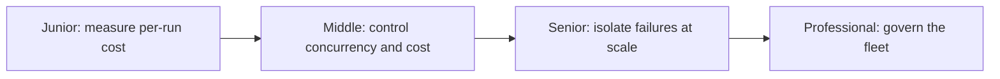

# Scaling Workflows

> A workflow that's correct at 1 run rarely stays correct unchanged at 100,000 runs a day. This subtopic is what changes — concurrency, cost, isolation — once a workflow becomes a fleet.

## Levels

| Level | Guide | You are done when |
|---|---|---|
| Junior | [Measure what breaks past one run](junior.md) | You can measure per-run cost, latency, and identify what rate limits or quotas you'll hit first. |
| Middle | [Control concurrency and cost](middle.md) | You can design worker pools, backpressure, and per-run budgets that hold at real volume. |
| Senior | [Isolate failures at scale](senior.md) | You can design bulkheads, circuit breakers, and caching that prevent one bad dependency from taking down the fleet. |
| Professional | [Govern the fleet](professional.md) | You can set SLOs, capacity plans, and cost attribution across every team's workflows. |

## Practice rule

Before assuming a workflow "will just scale," run it at 10x, then 100x the volume you tested at, and write down the first thing that breaks. That's your actual scaling bottleneck — not a guess.

## Related

- [Reliability and Recovery](../reliability-and-recovery/) — the retry and gate logic that has to behave correctly under concurrent load, not just in isolation.
- [State, Memory, and Durability](../state-memory-and-durability/) — checkpointing itself becomes a cost and throughput concern at fleet scale.
- [Agent Evaluation](../../agent-evaluation/) — measuring whether the fleet is actually meeting its reliability and cost targets in production.
