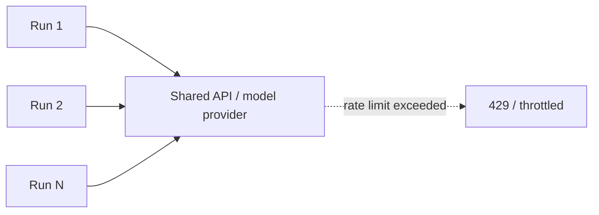

# Scaling Workflows — Junior

<!-- level-focus -->
At junior level, focus on this question:

> A workflow works correctly for one run. Before assuming it works for a thousand runs, can you measure its per-run cost and latency, and identify the specific limit (rate limit, quota, timeout) you'll hit first as volume grows?

---

## Why one working run doesn't mean it scales

- A workflow tested with one ticket at a time has never had to share a rate limit, a connection pool, or a cost budget with a hundred other runs happening at once.
- The first thing that breaks at higher volume is rarely "the logic is wrong" — it's usually a shared resource (an API rate limit, a database connection limit, a provider token quota) that one run alone never touched.

## Rate limits, quotas, and timeouts

- **Rate limit**: a cap on requests per unit time to an API (model provider, external tool) — exceeding it gets you throttled or rejected, not slowed down gracefully by default.
- **Quota**: a cap on total usage over a longer window (daily token budget, monthly API call allowance).
- **Timeout**: still applies per call (from Reliability and Recovery), but under load, calls that normally finish quickly can queue behind others and take longer, making a timeout tuned for one run at a time fire incorrectly under real concurrency.

## Sync vs. queued execution

- **Synchronous**: a run executes immediately when triggered, and the caller waits for it to finish. Simple, but if 1,000 tickets arrive at once, 1,000 synchronous runs compete for the same rate limit simultaneously.
- **Queued**: a run is placed in a queue and picked up by a worker when capacity allows — this naturally smooths out bursts instead of hitting every shared resource at the same instant.

## Measuring per-run cost and latency

- Before assuming a workflow scales, measure, for a realistic sample of runs: total tokens consumed, total latency, number of external calls made.
- Multiply by expected volume (e.g., per-run cost × 100,000 tickets/day) to get the real daily cost and total call volume — a workflow that looks cheap per run can be unexpectedly expensive or rate-limited at real scale.

## Common Mistakes

- **Assuming a workflow scales because it worked in testing with one run at a time.** Testing at low concurrency never exercises the shared rate limit or quota that appears at real volume.
- **Running everything synchronously with no queue.** A burst of simultaneous triggers hits shared resources all at once instead of being smoothed out.
- **Never multiplying per-run cost by expected volume before launch.** A workflow that seems cheap in a demo can be a significant, unplanned cost once running against real daily traffic.

## Apply It

1. Measure your workflow's per-run token usage, latency, and number of external calls on a realistic sample.
2. Multiply per-run cost by your expected daily volume, and write down the resulting daily cost and total external call count.
3. Identify the specific rate limit or quota (from your model provider or any external tool) you'd hit first at that volume.
4. Decide whether your workflow currently runs synchronously or queued, and whether that matches the expected burst pattern.

## Verify Your Work

- You have an actual measured per-run cost and latency number, not an estimate.
- You've multiplied that by expected volume and can state the resulting daily cost.
- You can name the specific rate limit or quota that would be hit first, not just "it might get rate limited eventually."

## Review Questions

- Why doesn't a workflow working correctly for one run guarantee it works at 100 concurrent runs?
- What's the difference between a rate limit and a quota, and why does each matter separately?
- Why does synchronous execution handle bursts worse than queued execution?
