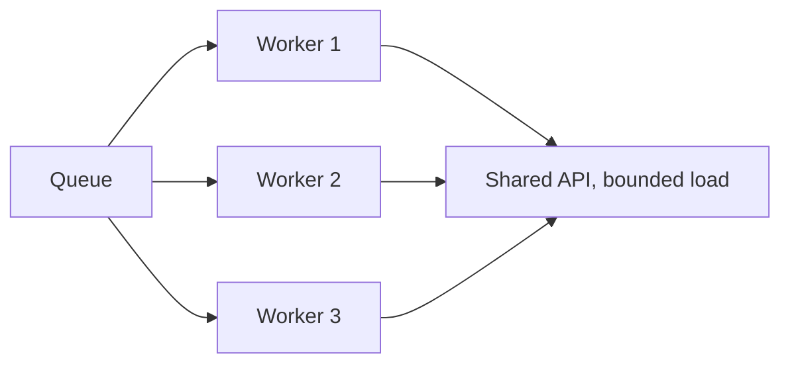

# Scaling Workflows — Middle

<!-- level-focus -->
At middle level, focus on this question:

> At real production volume, can you design worker pools with bounded concurrency, backpressure that smooths bursts instead of dropping work, and per-run cost budgets that catch a runaway workflow before it becomes a large bill?

---

## Worker pools and bounded concurrency

- A worker pool runs a fixed number of workflow instances concurrently, pulling new runs from a queue as workers free up — this bounds how many runs simultaneously compete for shared rate limits, instead of letting every triggered run start immediately.
- Set the pool size based on the shared resource's actual limit (e.g., if the model provider allows 50 requests/second and each run makes ~2 requests, a pool much larger than 25 concurrent runs will hit the rate limit regardless of queue depth).

## Backpressure

- Backpressure is what happens when incoming work exceeds what the worker pool can currently process — the queue grows instead of the system falling over.
- Without backpressure handling, a burst either overwhelms the shared resource directly (no queue) or grows the queue unbounded (queue with no limit, eventually exhausting memory or making queued items too stale to be useful by the time they're processed).
- Set an explicit queue depth limit, and a defined behavior for what happens when it's exceeded: reject new work with a clear signal, or shed the oldest/lowest-priority items first.

## Retry with jitter

- When many runs retry a failed call at the same moment (e.g., all failing due to the same transient rate-limit event), retrying them all after the identical fixed delay recreates the same spike that caused the failure.
- Add jitter — a small random variation to each retry's delay — so retries spread out over a window instead of arriving simultaneously again.

## Per-run token/cost budgets

- Set a hard cap on tokens or cost per individual run (from Workflow Fundamentals' stopping conditions, applied specifically for cost control at scale) — a single run that starts looping or retrying excessively shouldn't be able to consume unbounded cost before anyone notices.
- Alert (not just cap) when a run approaches its budget, so a systematic issue (a prompt change causing longer outputs across all runs) is caught before it silently inflates the whole fleet's cost.

## Model tiering

- Not every step needs the most capable (and most expensive) model — route steps by required capability: a cheap, fast model for classification/routing steps, a more capable model reserved for the step that genuinely needs deeper reasoning.
- This is the workflow-scale version of the determinism-boundary principle (Workflow Fundamentals, senior level): use the minimum capability that reliably solves each specific step, not the most powerful option everywhere by default.

## Cross-Component Scenario

The support-ticket workflow needs to handle 10,000 tickets/day, arriving in bursts during business hours.

1. Size the worker pool against the model provider's actual rate limit, not a round number.
2. Set a queue depth limit with a defined overflow behavior (e.g., reject with "high volume, will process shortly" rather than silently dropping).
3. Route the routing/classification step (Workflow Fundamentals middle level) to a cheaper, faster model; reserve the more capable model for drafting the customer-facing reply.
4. Set a per-run token budget with an alert threshold below the hard cap, so a prompt regression that inflates output length across the fleet is caught early.

## Common Mistakes

- **Sizing a worker pool without checking the actual rate limit it's bounded by.** A pool of 100 doesn't help if the shared API only tolerates 20 concurrent calls — you'll just get more requests failing at once.
- **A queue with no depth limit.** Under sustained overload, an unbounded queue either exhausts memory or fills with items so stale by the time they're processed that the result is no longer useful.
- **Retrying without jitter.** Fixed-delay retries across many simultaneously-failing runs recreate the exact load spike that caused the failures.
- **No per-run cost cap.** A single misbehaving run (stuck in a retry loop, or an unusually long context) can consume disproportionate cost with nothing stopping it until someone notices the bill.
- **Using the most capable model for every step by default.** Pays premium cost for steps (like classification) that a cheaper model handles just as reliably.

## Apply It

1. Determine the actual rate limit or quota your workflow's shared dependencies impose, and size your worker pool against it.
2. Set an explicit queue depth limit and write the overflow behavior.
3. Add jitter to your retry logic and state the jitter range.
4. Set a per-run cost/token budget with both an alert threshold and a hard cap.
5. Identify at least one step that could move to a cheaper model without losing reliability.

## Verify Your Work

- The worker pool size is derived from an actual measured rate limit, not a round number picked without checking.
- The queue has an explicit depth limit and a stated overflow behavior.
- Retries include jitter, with a stated range.
- A per-run cost budget exists with both an alert threshold and a hard cap.

## Review Questions

- Why does a worker pool need to be sized against the shared resource's actual limit, not an arbitrary number?
- What happens to an unbounded queue under sustained overload, and what's the fix?
- Why does retry jitter matter more as the number of concurrently-retrying runs grows?
- Why route cheap steps to a cheaper model instead of using the most capable model everywhere?
