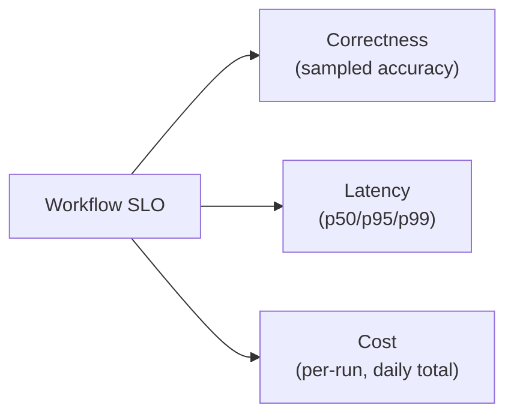

# Scaling Workflows — Professional

<!-- level-focus -->
At professional level, focus on this question:

> How do you run fleet-level governance across every team's workflows — SLOs that cover correctness, latency, and cost together, capacity planning against real provider limits, cost attribution per team, and an incident model with a real kill switch — so no single team's workflow can silently degrade the whole fleet or blow the budget?

---

## SLOs for agentic workflows: correctness, latency, and cost together

- A workflow SLO that only tracks uptime misses the two failure modes most specific to agentic systems: a workflow can be "up" and still be wrong (low correctness) or "up" and unexpectedly expensive (cost regression) without a single request technically failing.
- Define an SLO with at least three dimensions: **correctness** (a sampled, human- or eval-graded accuracy rate — see [Agent Evaluation](../../agent-evaluation/)), **latency** (p50/p95/p99 per run), **cost** (per-run and aggregate daily spend) — and alert on regressions in any of the three independently.

## Capacity planning against real provider limits

- Aggregate expected volume across every team's workflows that share a model provider or external dependency — a single team's capacity plan looking fine in isolation can still collectively exceed a shared provider quota once every team's workflows are summed.
- Negotiate or reserve capacity ahead of known volume increases (a marketing campaign, a seasonal peak) rather than discovering the shared rate limit is exceeded on the day it matters most.

## Multi-tenant capacity and quota policy

- Extend the per-tenant isolation from senior level into an explicit, published policy: each team or tenant gets a stated concurrency and cost quota, with a process for requesting more (based on justified, forecasted volume) rather than an unbounded shared pool that rewards whichever team scales fastest.
- Quota policy should be visible to every team, not a hidden allocation only the platform team can see — teams need to plan their own capacity against a known, stable number.

## Incident model and kill switches

- Every production workflow needs a **kill switch** — a way to disable or pause it immediately, independent of a code deploy, for when a workflow is actively causing harm (a runaway cost spike, a policy-violating output going out to customers) and there's no time to wait for a normal release cycle.
- The incident model defines: who can pull the kill switch, what happens to in-flight runs when it's pulled (do they complete on the durable checkpoint from State, Memory, and Durability, or halt entirely), and the escalation path for deciding to use it.

## Cost attribution per team

- Every workflow run's cost should be attributable to the owning team, not lumped into a single undifferentiated LLM-spend line item — without attribution, no team has the visibility or incentive to notice their own workflow's cost regression.
- Attribution should be granular enough to catch a regression at the workflow level, not just the team level — a team owning ten workflows needs to know which one's cost changed, not just that the team's total spend went up.

## Rollout decomposition for fleet-wide changes

- A change that affects every team's workflows (a shared library update, a new default model version) rolls out the same staged way as a single workflow's autonomy change: shadow, partial (one team or a percentage of traffic), full — because a fleet-wide change has fleet-wide blast radius if it goes wrong.

## Outcome measures and exit conditions

- Define, for the fleet as a whole, the SLO thresholds that trigger an incident review (e.g., aggregate cost exceeding forecast by X%, fleet-wide correctness sample dropping below a stated floor) — and a review cadence (e.g., quarterly) for whether the SLO targets themselves are still the right ones as the fleet grows.

## Cross-Team Contracts and Sustained Delivery

- Publish the SLO definitions, quota policy, and kill-switch process as documentation every team can reference — the same discipline as publishing an API's SLA, because from another team's perspective, your shared workflow infrastructure is exactly that.
- Require every new workflow, before it goes to full production traffic, to have its SLO dimensions defined and its cost attribution wired up — not added retroactively after an incident reveals the gap.

## Common Mistakes

- **An SLO that only tracks latency/uptime, missing correctness and cost.** A workflow can be technically "healthy" by uptime standards while quietly producing wrong answers or burning an unplanned budget.
- **Capacity planning done per-team in isolation.** Misses the case where every team's individually-reasonable plan collectively exceeds a shared provider quota.
- **No kill switch, or a kill switch that requires a full deploy cycle to activate.** During an active incident, waiting for a normal release process to disable a harmful workflow multiplies the damage.
- **Cost lumped into one undifferentiated line item.** No team has visibility into their own workflow's cost trend, so regressions go unnoticed until the aggregate bill is already high.
- **Fleet-wide changes rolled out to 100% of traffic at once.** A shared library or default-model change with a bug affects every team's workflows simultaneously, instead of being caught in a shadow or partial stage first.

## Real-World Examples

- **A cost SLO catches a silent regression before the monthly bill does.** A prompt template change causes average output length to grow across a fleet of workflows sharing that template; the per-workflow cost SLO alerts within a day of the change shipping, rather than the regression only being noticed when the monthly invoice arrives.
- **A kill switch limits the blast radius of a bad output.** A workflow starts producing policy-violating responses due to an upstream data issue; the on-call engineer pulls the kill switch within minutes, pausing new runs while in-flight runs complete on their durable checkpoints, rather than waiting for a code fix and full redeploy.

## Apply It

1. Define the three-dimension SLO (correctness, latency, cost) for a workflow you own, with specific thresholds.
2. Check whether your capacity plan for this workflow accounts for other teams' workflows sharing the same provider or dependency.
3. Confirm a kill switch exists for this workflow, and write who can activate it and what happens to in-flight runs when it's pulled.
4. Confirm this workflow's cost is attributable at the workflow level, not just the team level.

## Verify Your Work

- The SLO has explicit thresholds for correctness, latency, and cost — not just an uptime number.
- The capacity plan accounts for shared provider limits across every workflow that uses them, not just this one team's usage.
- A kill switch exists, with a stated owner and a defined behavior for in-flight runs.
- Cost is attributable to this specific workflow, not merged into an undifferentiated total.

## Review Questions

- Why does an agentic workflow's SLO need to track correctness and cost, not just latency and uptime?
- What's the risk of each team planning capacity against a shared provider limit in isolation?
- Why does a kill switch need to work independently of a normal code-deploy cycle?
- What's the cost of leaving workflow spend as one undifferentiated line item instead of attributing it per workflow?
