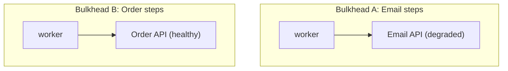

# Scaling Workflows — Senior

<!-- level-focus -->
At senior level, focus on this question:

> When one dependency starts failing or one tenant starts misbehaving, can you design bulkheads and circuit breakers that contain the damage to that one dependency or tenant, instead of letting it degrade or take down the entire fleet?

---

## Bulkheads per step type

- A bulkhead isolates the resource pool (worker threads, connections) used by one kind of step from another, so a slow or failing step type can't exhaust the resources every other step type also needs.
- Example: if the "send confirmation email" step's provider is degraded and calls are hanging, a bulkhead ensures those hung calls only exhaust the pool dedicated to email steps — refund-processing and order-lookup steps keep working normally because they draw from separate pools.

## Circuit breakers on flaky tools

- A circuit breaker tracks a dependency's recent failure rate; once it crosses a threshold, the breaker "opens" — new calls to that dependency fail fast (without even attempting the call) for a cooldown period, instead of every run waiting out the dependency's full timeout one by one.
- After the cooldown, the breaker allows a small number of test calls through ("half-open"); if they succeed, it closes and resumes normal traffic — if they fail again, it stays open longer.
- This protects both the failing dependency (reducing load on something already struggling) and your own workflow's latency (failing fast instead of every run separately discovering the same timeout).

## Graceful degradation and fallback paths

- When a non-critical dependency is unavailable, define a fallback that lets the workflow continue in a reduced capacity rather than failing the whole run.
- Example: if a personalization lookup (fetching a customer's stated communication preference) is down, fall back to a default channel rather than failing the entire ticket-response workflow over a non-essential enhancement.
- Reserve "fail the whole run" for dependencies that are genuinely load-bearing (e.g., the order-lookup step can't degrade gracefully — there's no meaningful fallback for "look up an order" if the order database is unreachable).

## Tail latency in fan-out joins

- In a fan-out/fan-in pattern (Orchestration and Delegation), the join step's total latency is bounded by the *slowest* of the parallel branches, not the average — a single consistently-slow sub-agent or step drags down every run that uses it.
- Set a per-branch timeout inside the join, with a defined behavior for a branch that doesn't return in time (proceed without it if the missing branch is non-critical, or fail the run if it's load-bearing) — don't let one slow branch silently make every fan-out run slow.

## Hot-partition / noisy-tenant isolation

- If your workflow serves multiple tenants (customers, teams, business units) sharing the same infrastructure, one tenant sending an unusually large burst of traffic ("noisy neighbor") shouldn't be able to consume the shared worker pool and starve every other tenant's runs.
- Isolate by giving each tenant (or tenant tier) its own bounded slice of concurrency/rate-limit budget, rather than a single shared pool with no per-tenant cap.

## Caching

- **Prompt caching**: if the same fixed instructions or context prefix repeats across many runs, caching lets the provider skip reprocessing the unchanged portion, reducing latency and cost.
- **Result caching**: if the same input genuinely produces the same correct output (e.g., a lookup by a stable key), cache the result and skip recomputation — but only for steps confirmed idempotent and stable, not steps whose "correct" answer can legitimately change between calls.
- **Semantic caching**: for near-duplicate inputs (not byte-identical, but similar enough that the same cached answer applies), a similarity-based cache lookup can avoid a redundant model call — but requires care that "similar enough" doesn't silently reuse a stale or wrong answer for a subtly different request.

## Common Mistakes

- **No bulkhead — every step type shares one resource pool.** One slow dependency exhausts the shared pool and every other step type degrades along with it, even though they don't actually depend on the failing dependency.
- **No circuit breaker on a known-flaky dependency.** Every run individually discovers the same timeout, multiplying wasted latency across the fleet instead of failing fast after the first few failures.
- **Treating every dependency as load-bearing with no fallback.** Fails the entire run over a non-essential enhancement that had a reasonable degraded-mode default available.
- **No per-branch timeout in a fan-out join.** A single slow sub-agent silently sets the latency floor for every run that uses that fan-out pattern.
- **A single shared resource pool across all tenants.** One tenant's traffic spike can starve every other tenant with no isolation.

## Apply It

1. Identify which of your workflow's step types should be isolated into separate bulkheads, and why.
2. Design a circuit breaker for your flakiest external dependency: failure-rate threshold, cooldown period, half-open test volume.
3. For each non-critical dependency, write its fallback/degraded-mode behavior; for each load-bearing dependency, confirm there genuinely is no fallback and the run should fail.
4. Set a per-branch timeout inside any fan-out join, with a stated behavior for a branch that misses it.
5. If multi-tenant, design the per-tenant concurrency/rate-limit isolation.

## Verify Your Work

- Step types that don't share a failure mode are isolated into separate bulkheads.
- The circuit breaker has stated numbers (failure threshold, cooldown, half-open volume), not vague "opens when it's failing a lot."
- Every dependency is explicitly marked load-bearing (no fallback, run fails) or non-critical (fallback defined).
- Fan-out joins have a per-branch timeout with a stated behavior for a missed branch.

## Review Questions

- Why does a bulkhead prevent one failing dependency from degrading unrelated step types?
- What does a circuit breaker's "half-open" state test for, and why not just close it immediately after the cooldown?
- Why is fan-out join latency bounded by the slowest branch, and what's the fix?
- What distinguishes a dependency that deserves a graceful-degradation fallback from one that should fail the whole run?
