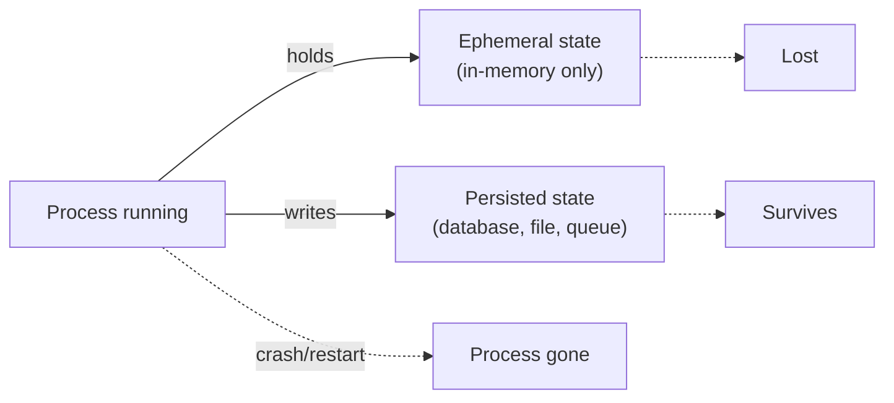

# State, Memory, and Durability — Junior

<!-- level-focus -->
At junior level, focus on this question:

> For a running workflow, can you point to exactly what state exists at any given moment, where it lives, and which parts would disappear if the process restarted right now?

---

## Two kinds of state

- **Ephemeral (in-memory) state**: exists only while the process is running — variables in a function, the conversation array held in a local list. Gone the instant the process restarts.
- **Persisted state**: written somewhere that survives a restart — a database row, a file, a message queue entry.
- A workflow is only as durable as its persisted state — anything left only in memory is lost the moment the process crashes, is redeployed, or the machine restarts.

## Run ID and step ID

- Every workflow run needs a unique **run ID**, generated once when the run starts, so any later state can be tied back to "this specific execution."
- Every step within a run needs a **step ID** (or step index) so you can say precisely "run #4521 is currently at step 3 of 5."
- Without these two IDs, you cannot answer "what is this workflow currently doing?" for any specific in-flight run — you'd have to guess from logs.

## What a simple workflow's state actually contains

For the support-ticket routing workflow (from earlier subtopics), at any point mid-run:

- `run_id`: unique identifier for this ticket's processing.
- `current_step`: which step it's at (e.g., "fetched order," "drafted reply," "awaiting send").
- `accumulated_fields`: the specific named fields collected so far (order_id, classification, draft_text) — not the whole conversation blob.

## Common Mistakes

- **Assuming in-memory state is safe because the process "usually doesn't crash."** Deployments, autoscaling, and provider outages restart processes routinely — designing as if that never happens guarantees an eventual silent data loss.
- **No run ID.** Without one, there's no way to look up "what happened to ticket #4521's processing" after the fact, or to know which persisted rows belong to which run.
- **Persisting the whole raw request/response blob instead of named fields.** Makes it hard to know later which specific field a resumed step actually needs.

## Apply It

1. For a workflow you're building, list every piece of state it holds at each step, and mark each as ephemeral or persisted.
2. Confirm a run ID and step ID both exist and are written to persisted storage before the first step even runs.
3. Simulate a crash: pick a step, and write down exactly what state would be lost if the process died right after that step, before the next line of code ran.

## Verify Your Work

- Every piece of state is explicitly marked ephemeral or persisted — not assumed.
- A run ID exists and is assigned before step 1 begins, not generated lazily after something goes wrong.
- You can name the exact state that would be lost from a crash at any given step.

## Review Questions

- What's the practical difference between ephemeral and persisted state, in terms of what survives a restart?
- Why does every run need a unique run ID assigned at the very start?
- What state would be lost if your workflow's process restarted mid-step, and does that matter for this specific workflow?
