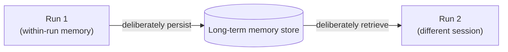

# State, Memory, and Durability — Middle

<!-- level-focus -->
At middle level, focus on this question:

> For an agent that spans multiple sessions over days or weeks, what specifically persists as long-term memory, what stays scoped to a single run, and how does persisted memory actually get back into the model's context when it's needed?

---

## Two kinds of memory, not one

- **Within-run memory**: everything accumulated during one workflow execution (the handoff contract fields, the ReAct loop's observation history). Scoped to the run ID from junior level; naturally cleaned up when the run completes.
- **Cross-run (long-term) memory**: facts that should be available to a future, different run — "this customer already had a refund declined last month," "this customer prefers email over chat." This must be deliberately persisted and deliberately retrieved; it does not happen automatically.

## Deciding what persists

- Not everything that happened deserves to become long-term memory — write down the specific criterion for a fact to persist:
  - It changes how a future run should behave (e.g., "declined a refund for policy violation" should influence a future refund request from the same customer).
  - It's cheap and safe to store (no sensitive data beyond what's needed, retention policy considered).
- A fact that doesn't meet the "changes future behavior" bar is noise in long-term memory — storing every detail of every past interaction makes retrieval (next section) harder, not more helpful.

## How memory gets back into context

- Long-term memory isn't automatically visible to a new run — a run must explicitly fetch relevant memory and insert it into the prompt/context before reasoning starts.
- Two common retrieval strategies:
  - **Direct lookup**: fetch by a known key (customer ID → their record) when the memory is structured and the key is known at run start.
  - **Semantic/similarity retrieval**: when the relevant memory isn't identified by a known key, search stored memories by relevance to the current situation (this overlaps with RAG techniques — see [Knowledge Base](../../knowledge-base/rag-techniques/)).
- Whichever strategy is used, only the specific relevant memory should be inserted into context — not "fetch everything ever stored about this customer," which reintroduces the context-blob problem from Orchestration and Delegation.

## Cross-Component Scenario: The Returning Customer

A customer who had a refund request declined last month messages again about a different issue.

1. At run start, the workflow does a **direct lookup** by customer ID against long-term memory.
2. It retrieves the specific relevant fact: `{prior_refund_status: "declined", reason: "outside policy window"}` — not their entire interaction history.
3. This fact is inserted into the current run's context only if it's relevant to the current request (e.g., if this new message is also about a refund) — an unrelated technical question shouldn't be burdened with irrelevant refund history.

## Common Mistakes

- **Persisting every detail of every run "in case it's useful later."** Makes future retrieval noisier and raises data-retention and privacy exposure for no proven benefit.
- **Assuming long-term memory is automatically available.** A new run that doesn't explicitly fetch and insert relevant memory behaves as if the customer has no history, even though the record exists.
- **Retrieving and inserting irrelevant memory into every run regardless of relevance.** Wastes context budget and can mislead the model into treating unrelated history as relevant to the current task.

## Apply It

1. For your workflow, write the specific criterion for a fact to be promoted from within-run to long-term memory.
2. Decide the retrieval strategy (direct lookup vs. semantic) for that memory, and justify the choice.
3. Write the exact scope of what gets inserted into a new run's context — confirm it's the specific relevant fact, not the customer's full history.

## Verify Your Work

- The persistence criterion names a specific reason a fact changes future behavior — not "just in case."
- The retrieval strategy matches how the memory is keyed (known ID vs. unknown, needing similarity search).
- What gets inserted into context is scoped to what's relevant to the current run, confirmed by example.

## Review Questions

- What's the difference between within-run memory and long-term memory, and why does within-run memory not need a persistence decision the same way?
- What criterion decides whether a fact is worth persisting as long-term memory?
- Why doesn't long-term memory automatically appear in a new run's context, and what has to happen for it to get there?
