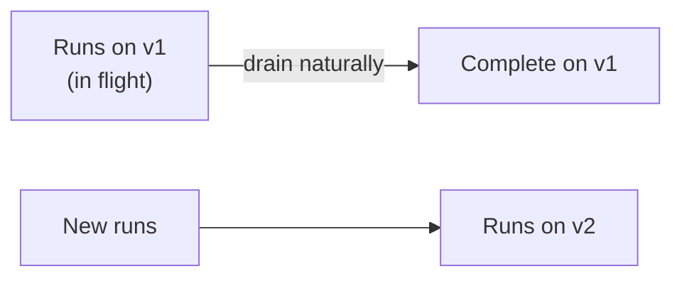

# State, Memory, and Durability — Professional

<!-- level-focus -->
At professional level, focus on this question:

> How do you deploy a new version of a workflow's code or state schema while thousands of prior runs are still in flight, without corrupting their checkpoints or silently changing their behavior mid-execution?

---

## The core problem: code changes, but checkpoints were written by the old code

- A durable workflow (from senior level) may have runs that started days or weeks ago and are still resuming from checkpoints. If you deploy a new version of the workflow's step logic, an in-flight run's next resume will execute under the new code — but its checkpoint was written under assumptions from the old code.
- This is fundamentally a versioning problem, the same class of problem as a database schema migration while the database is live — except here, "live" runs can span days.

## Strategies for versioning in-flight workflows

- **Version pinning**: tag every run with the workflow-code version it started under; route resumes of that run to the matching version of the code until it completes, and only route new runs to the new version.
- **Compatible migration**: design the new version to still understand old checkpoints (e.g., a new optional field defaults safely for old checkpoints that don't have it) — requires discipline in schema design, not a guarantee.
- **Drain and cutover**: let all in-flight runs on the old version complete naturally (or force-complete/cancel long-tail stragglers after a deadline), then cut over fully once the old version's run count reaches zero.

- Version pinning is usually the safest default for workflows with side effects — it guarantees a run's behavior doesn't shift mid-execution, at the cost of running two code versions simultaneously for a while.

## State schema evolution

- Treat the checkpoint's state schema (the fields recorded per step) the same way you'd treat a public API schema: additive changes (new optional fields) are safe; removing or repurposing a field breaks any in-flight run whose checkpoint still references the old meaning.
- Never repurpose an existing field's meaning for a new version — add a new field instead, and have the new code read the new field with a fallback to the old one for checkpoints written before the change.

## Replay determinism for audit

- If your durable-execution model relies on replaying the event log to reconstruct state (from senior level), the replay must be deterministic — replaying the same log twice must produce the same reconstructed state, or you can't trust the reconstruction for an audit or an incident investigation.
- Anything non-deterministic (a fresh model call, current timestamp, random selection) must not be re-executed during replay — its result should be read from the log, not recomputed, so replay reconstructs history rather than generating new history.

## Build vs. buy a durable execution engine

| Factor | Points toward building your own | Points toward buying (e.g., Temporal-style engine) |
|---|---|---|
| Number of distinct durable workflows | One or two simple ones | Many, across multiple teams |
| Side-effect complexity | Few side effects, simple compensation | Many side effects, complex saga/compensation chains |
| Team's operational capacity | Small team, can't own a new distributed system | Platform team already operates distributed infrastructure |
| Versioning/migration need | Rare, simple workflows | Frequent code changes to long-running workflows |

- A hand-rolled checkpoint table is a legitimate choice for a small number of simple workflows — don't adopt a full durable-execution engine as a default before the complexity justifies its operational cost.

## Cross-Team Contracts and Sustained Delivery

- When a durable workflow's checkpoint schema or version-pinning policy affects other teams (e.g., a shared refund workflow other teams' code triggers), publish the versioning policy the same way you'd publish an API deprecation policy — teams calling into it need to know whether in-flight runs will complete on the version they started with.
- Audit and replay tooling (reconstructing exactly what a specific run did and why) should be a shared capability, not rebuilt per workflow — it's what compliance and incident investigation both depend on.

## Common Mistakes

- **Deploying new step logic without version-pinning in-flight runs.** A run resumes mid-execution under logic that assumes state its old checkpoint doesn't have, producing subtle bugs that only affect long-running, in-flight executions — the hardest kind to reproduce.
- **Repurposing a checkpoint field's meaning instead of adding a new one.** Silently breaks every in-flight run whose checkpoint was written under the old meaning.
- **Non-deterministic operations re-executed during replay.** A replay that re-calls the model, or re-generates a random value, reconstructs a different history than what actually happened — undermining the entire point of the audit trail.
- **Adopting a full durable-execution engine before the operational complexity justifies it.** Running a distributed workflow engine has real operational cost; a team with two simple workflows may be better served by a straightforward checkpoint table.

## Real-World Examples

- **Version pinning avoids a corrupted mid-flight refund.** A workflow update changes how the refund-amount calculation reads its input; runs already in flight are pinned to the prior version until they complete naturally, avoiding a scenario where an in-flight refund calculation silently changes formula mid-execution.
- **Replay determinism catches a compliance question months later.** An auditor asks why a specific refund was approved six months prior; because the event log recorded the model's exact output at the time (not a value recomputed on replay), the reconstruction matches what actually happened, and the question is answered from the log rather than guesswork.

## Apply It

1. For a durable workflow you own (or plan to build), write the versioning strategy for a future code change: pinning, compatible migration, or drain-and-cutover — and justify the choice.
2. Write one schema-evolution rule for your checkpoint format (e.g., "new fields are always optional with a safe default").
3. Confirm every non-deterministic operation in your workflow (model calls, timestamps, random choices) has its result recorded in the log rather than recomputed on replay.
4. Run the build-vs-buy table for your own situation and write the resulting decision.

## Verify Your Work

- The versioning strategy is named explicitly (pinning, compatible migration, or drain) — not left as "we'll figure it out at deploy time."
- The checkpoint schema has a stated evolution rule that avoids repurposing existing fields.
- Every non-deterministic operation's result is confirmed to come from the log during replay, not recomputation.
- The build-vs-buy decision cites specific factors from the table, not a default preference.

## Review Questions

- Why is deploying new workflow code while runs are in flight a versioning problem rather than a simple deployment?
- What's the risk of repurposing an existing checkpoint field's meaning instead of adding a new field?
- Why must non-deterministic operations be logged and read back during replay rather than recomputed?
- What factors should decide whether a team builds its own durable-execution mechanism or adopts an existing engine?
