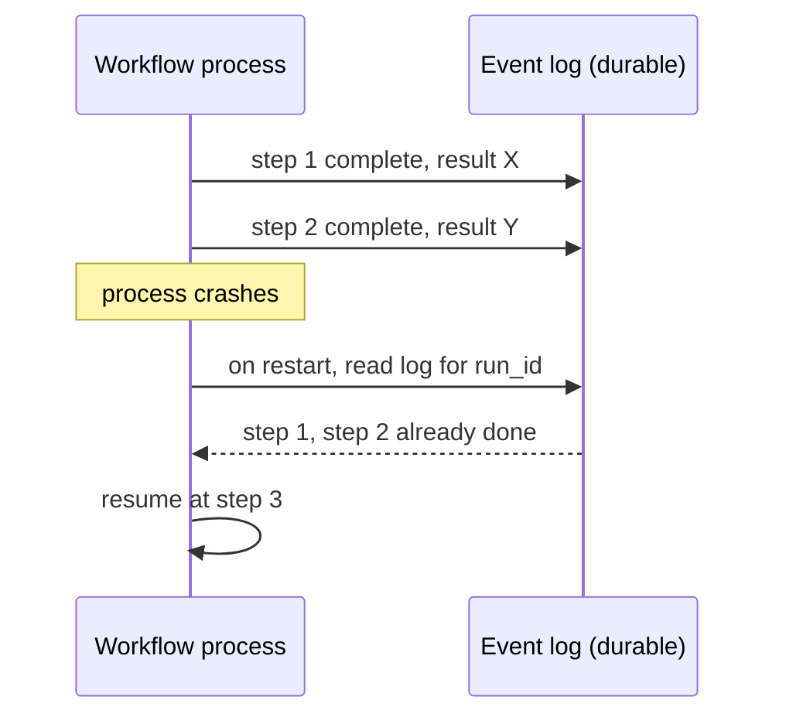
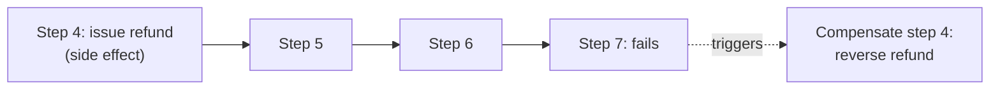

# State, Memory, and Durability — Senior

<!-- level-focus -->
At senior level, focus on this question:

> For a workflow that must survive a crash mid-run, or pause for hours waiting on a human, can you design checkpointing that resumes without redoing side effects, and a rollback plan for when a later step fails after an earlier step already changed the world?

---

## Durable execution: event log plus replay

- The core idea: instead of trusting in-memory state, persist every step's outcome as an event in an append-only log, tied to the run ID. To resume, replay the log to reconstruct where the run left off, then continue from there.
- This is the mechanism behind durable-execution engines (e.g., Temporal-style workflow engines) — you can build a lighter version yourself for simpler workflows using a database table of `(run_id, step_id, status, result)`.

## Checkpointing after each step

- Write a checkpoint (step ID + status + result) to durable storage immediately after each step completes, before starting the next step — not in a batch at the end of the run.
- On resume, read the latest checkpoint for the run ID and continue from the next un-completed step, rather than re-running the whole workflow from scratch.

## Idempotency keys on tool calls with side effects

- A step that calls an external system with a real side effect (charge a card, issue a refund, send an email) must be safe to retry without repeating the effect.
- Attach an idempotency key (often the run ID + step ID) to the call; the external system (or a wrapper around it) uses that key to recognize "this exact call already happened" and returns the prior result instead of executing again.
- Without an idempotency key, a checkpoint-and-resume design can accidentally issue the same refund twice if the crash happened after the refund executed but before the checkpoint recording "refund done" was written.

## Retry semantics: safe vs. unsafe to retry

- **Safe to retry (idempotent)**: read-only lookups, and any write protected by an idempotency key.
- **Unsafe to retry without a key**: any write to an external system that has no idempotency mechanism — retrying blindly risks a duplicate effect.
- At-least-once delivery is the honest default for most durable systems — a message or step can be delivered/executed more than once during recovery. Idempotency is what makes "at least once" behave like "effectively once" from the outside.

## Pausing at a human-approval gate for hours or days

- A workflow waiting on human approval (see Reliability and Recovery) isn't "stuck" — it's a checkpoint recorded as "awaiting approval," and the process can shut down entirely while waiting.
- On approval (which may arrive via a separate event, hours or days later), the workflow resumes from that exact checkpoint using the run ID, rather than requiring a process to stay alive the whole time.
- Design an explicit timeout for how long a run can sit in "awaiting approval" before it escalates or expires — an indefinite wait with no timeout is a stuck run nobody notices.

## Compensation and rollback (the saga pattern)

- When step 7 fails after step 4 already had a real side effect (e.g., already issued a partial refund), you can't just "undo" — you run a **compensating action**: a step whose job is to reverse or mitigate step 4's effect specifically.
- Define the compensating action for every step that has a side effect, at design time, not improvised after a failure — e.g., step 4 "issue refund" pairs with a compensating step "reverse refund with reason: workflow failed downstream."
- Not every side effect is reversible (an email already sent can't be unsent) — for those, the compensation is often a follow-up communication ("disregard the previous message") rather than a true undo, and that limitation should be acknowledged in the design, not discovered in an incident.

## Cross-Component Scenario: The Stuck Refund Workflow

The refund workflow checkpoints after each step. Step 4 issues a $340 refund; step 5 (send confirmation email) fails due to a transient email-service outage.

1. On restart or retry, the workflow reads its checkpoint: step 4 already completed successfully — it does **not** re-issue the refund (idempotency key confirms the effect already happened).
2. It resumes at step 5, retrying only the failed email send.
3. If step 5 continues to fail past a retry cap (see Reliability and Recovery), the workflow does not roll back the refund — sending a confirmation email failing is not a reason to reverse a correctly issued refund. The compensating action here is a fallback notification path (e.g., an internal alert to manually follow up), not reversing step 4.

## Common Mistakes

- **Checkpointing only at the end of a run.** If the process crashes mid-run, there's no record of partial progress, and resuming means re-running everything, including side effects that already happened.
- **No idempotency key on a side-effecting call.** A naive retry-from-checkpoint design will duplicate the refund, the email, or the charge if the crash timing is unlucky.
- **No compensating action defined for a step with a side effect.** When a later step fails, the team is left improvising a rollback under incident pressure instead of executing a pre-designed compensation.
- **Treating "awaiting approval" as a live process that must stay running.** Keeping a process alive for a multi-day approval wait wastes resources and is fragile against any restart during that wait.

## Apply It

1. For a workflow with side-effecting steps, design the checkpoint written after each step (fields: run_id, step_id, status, result).
2. Add an idempotency key to every side-effecting tool call, and write what the external system (or your wrapper) does when it sees a repeated key.
3. For each side-effecting step, write its compensating action, or explicitly note that the effect is irreversible and write the fallback (e.g., follow-up notification).
4. Design the timeout and escalation for a workflow paused at a human-approval gate.

## Verify Your Work

- A checkpoint is written after every step, not just at the end of the run.
- Every side-effecting call has an idempotency key, and you can state what happens on a repeated call with the same key.
- Every side-effecting step has either a compensating action or an explicit, written acknowledgment that it's irreversible plus a fallback.
- The approval-gate wait has an explicit timeout, not an indefinite hold.

## Review Questions

- Why does checkpointing after every step matter more than checkpointing only at the end?
- What does an idempotency key actually protect against, and why is "at least once" the honest default to design for?
- Why can't every side effect be reversed by a compensating action, and what should happen when it can't?
- Why should a workflow paused at a human-approval gate not require a live, continuously running process?
