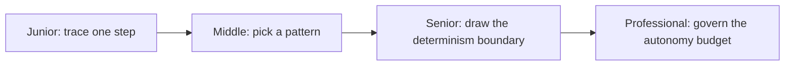

# Workflow Fundamentals

> A workflow is a graph of steps. Some steps are code, some are an LLM call, some are a full agent loop. The first design decision is always: how much of this graph should the model control?

## Levels

| Level | Guide | You are done when |
|---|---|---|
| Junior | [Trace one step, then a chain](junior.md) | You can tell a single LLM call apart from an agent loop, and write down a step's input/output contract. |
| Middle | [Pick the workflow pattern](middle.md) | You can choose among the 5 canonical patterns and justify it against latency, cost, and predictability. |
| Senior | [Draw the determinism boundary](senior.md) | You can say exactly which parts of a workflow the model decides and which parts code decides, and why. |
| Professional | [Govern the autonomy budget](professional.md) | You can set org-wide rules for how much autonomy a new workflow is allowed to start with. |

## Practice rule

Before adding a branch, a loop, or a sub-agent to a workflow, write down: "the model decides X here because code cannot." If you can't finish that sentence, that piece belongs in code, not in the model's hands.

## Related

- [Orchestration and Delegation](../orchestration-and-delegation/) — once a workflow needs more than one agent, this is how they hand off work.
- [Reliability and Recovery](../reliability-and-recovery/) — what happens when a step in this workflow fails or a human needs to approve it.
- [Tools and MCP](../../mcp/) — what a step actually calls when it acts.
