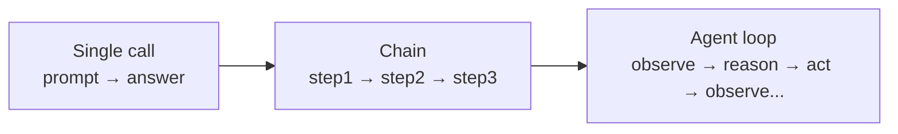
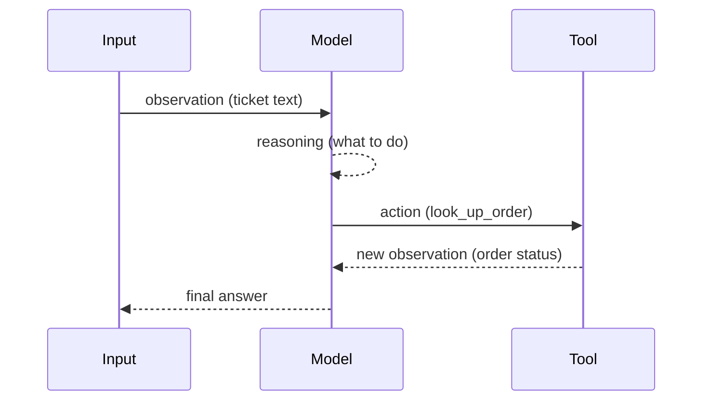

# Workflow Fundamentals — Junior

<!-- level-focus -->
At junior level, focus on this question:

> Given a single well-defined task, can you tell whether it needs one LLM call, a chain of calls, or a full agent loop — and can you write down the input/output contract for one step by hand?

---

## A single call is not a workflow

- **One LLM call**: prompt in, text out. No decision about what to do next — the caller already knows.
- **A chain**: fixed sequence of calls, each step's output feeding the next step's input, decided in advance by you, not the model.
- **An agent loop**: the model itself decides what to do next, observes the result, and decides again — the step sequence is not fixed in advance.

- Rule of thumb: if you can draw the exact sequence of steps before running it and it never changes, it's a chain, not an agent loop.
- A workflow is the umbrella term for all three — it's the graph of steps a task runs through, whichever kind each step is.

## The ReAct pattern, in one iteration

- **Observation** — what the agent currently knows (the ticket text, a tool result, an error message).
- **Reasoning** — the model's stated "what should happen next and why" (visible in output if you ask for it).
- **Action** — a tool call, or a final answer if nothing more is needed.
- **New observation** — the result of that action, fed back in for the next iteration.

## Trace one iteration by hand

For a task "look up order #4521 and tell the customer its status":

1. Write the exact observation text the model receives.
2. Write what you'd expect the model to reason (in plain words, not code).
3. Write the exact tool call it should emit — name and arguments.
4. Write the tool's return value.
5. Write the final answer the model should produce from that return value.

Doing this by hand for one real example before writing any code catches contract mismatches (wrong argument names, missing fields) before they become a production bug.

## Basic stopping conditions

Every loop needs an explicit answer to "when does this stop?" — not an implicit assumption:

- **Task complete** — the model emits a final answer instead of another tool call.
- **Max iterations** — a hard cap (e.g., 10 tool calls) so a confused model can't loop forever.
- **Max cost/tokens** — a budget per run, independent of iteration count.
- **Explicit failure** — a tool call fails in a way that can't be retried, and the loop exits with an error instead of guessing.

## Common Mistakes

- **Treating a fixed chain as if it needed agent reasoning.** If the step order never changes, hardcode it — don't pay for a model decision that has only one possible answer.
- **No stopping condition at all.** A loop with no iteration cap or cost budget can run until a provider-side timeout kills it, burning cost the whole time.
- **Vague step contracts.** "Step 2 takes the output of step 1" without specifying the exact fields breaks the moment step 1's output format changes.

## Apply It

1. Take a task you handle manually today. Decide: single call, chain, or agent loop — and write one sentence justifying the choice.
2. Write the input/output contract for the first step as a short list of named fields.
3. Trace one full ReAct iteration by hand for that task, writing every observation, action, and result explicitly.
4. Write the stopping condition(s) for that task, with real numbers (not "eventually stops").

## Verify Your Work

- You can point to the specific reason a task is a chain and not a loop (or vice versa) — not a preference.
- Every step's input/output contract names its fields explicitly.
- The stopping condition has a real number attached (iteration cap, cost cap), not just "when it's done."

## Review Questions

- What specifically distinguishes a chain from an agent loop?
- Why does tracing one iteration by hand before writing code matter?
- What are the four kinds of stopping conditions, and why do you need more than one?
- What breaks if a step's input/output contract is left implicit?
