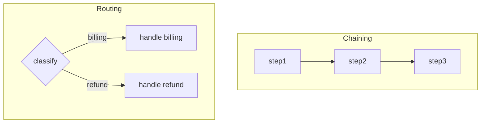

# Workflow Fundamentals — Middle

<!-- level-focus -->
At middle level, focus on this question:

> For a task more complex than one chain, which of the canonical workflow patterns fits — and can you justify that choice against latency, cost, and predictability instead of picking the most impressive-sounding option?

---

## The five canonical patterns

- **Prompt chaining** — fixed sequence, each step's output feeds the next. Use when the steps are always the same and order matters (e.g., extract → summarize → format).
- **Routing** — a classifier step picks one of several downstream paths. Use when inputs fall into distinct categories that need different handling (e.g., billing question vs. technical question vs. refund request).
- **Parallelization** — the same task run multiple times (voting) or split into independent sub-tasks run at once, then merged. Use when sub-tasks don't depend on each other, or when running several attempts and picking the best improves reliability.
- **Orchestrator-workers** — one step decides what sub-tasks are needed and dispatches them dynamically (not a fixed set of branches like routing). Use when the number and nature of sub-tasks can't be known in advance.
- **Evaluator-optimizer** — one step produces a candidate, another step scores it against a stated bar, and it loops until the bar is met. Use when quality is checkable but hard to get right on the first attempt.

## Plan-then-execute vs. interleaved reasoning

- **Plan-then-execute**: write out every step before running any of them, then execute in order, checking each output before moving on. Use when the steps are knowable in advance — this is prompt chaining with an explicit plan artifact.
- **Interleaved reasoning**: the model decides the next step based on the current observation, one step at a time (the ReAct loop from junior level). Use when the right next step genuinely depends on what the previous step returned.

The plan-then-execute path is strictly more predictable and cheaper to audit — always prefer it unless the task demonstrably needs the previous result to decide the next action.

## The rule: least autonomy that solves the problem

- Start every new workflow by asking "could this be a chain?" If yes, it's a chain — not routing, not an orchestrator.
- Only add routing when inputs genuinely fall into distinct categories that need different handling.
- Only add an orchestrator-workers pattern when the set of sub-tasks truly can't be enumerated in advance.
- Only add a full autonomous agent loop when the step sequence itself must be discovered at runtime, not just selected from a known set.

| Pattern | Predictability | Cost | When it's overkill |
|---|---|---|---|
| Chaining | Highest | Lowest | Never — it's the default |
| Routing | High | Low–medium | Using it for only 2 near-identical branches |
| Parallelization | High | Medium (N× calls) | Running N attempts when 1 is already reliable |
| Orchestrator-workers | Medium | Medium–high | Task list is actually fixed and known |
| Evaluator-optimizer | Medium | Medium–high (loops) | Quality bar is impossible to check objectively |
| Full agent loop | Lowest | Highest, most variable | Any of the above patterns would have worked |

## Cross-Component Scenario

The support-ticket task from junior level grows: tickets now include billing questions, refund requests, and technical questions.

1. Add a **routing** step: classify the ticket into one of three categories.
2. Each category runs its own **chain**: billing → look up invoice → draft answer; refund → look up order → check policy → draft answer; technical → search knowledge base → draft answer.
3. No step here needs a full agent loop yet — every path is a known, fixed chain once routed.

## Common Mistakes

- **Reaching for an agent loop by default.** The most flexible pattern is also the least predictable and most expensive — it should be the last pattern considered, not the first.
- **Building routing for two branches that behave almost identically.** If both branches do nearly the same thing, merge them into one chain with a small conditional inside a step.
- **Using parallelization (voting) without a way to pick the winner.** Running 3 attempts and returning the first one back defeats the purpose — you need an explicit selection or merge step.

## Apply It

1. Take a task from your own work and match it to one of the 5 patterns, writing the one sentence that justifies the match.
2. Draw the pattern as a small flowchart (fixed steps, decision points, or dynamic dispatch — whichever applies).
3. Write down which parts of the task, if any, still can't be reduced below a full agent loop, and why.

## Verify Your Work

- The chosen pattern is the least autonomous one that still solves the task — you can name the simpler pattern you rejected and why it didn't work.
- The flowchart has no more nodes than the task actually needs.
- Any part left as a full agent loop has a stated reason code can't decide it.

## Review Questions

- What is the difference between routing and orchestrator-workers, and when does each apply?
- Why should plan-then-execute be preferred over interleaved reasoning whenever the steps are knowable in advance?
- What does "least autonomy that solves the problem" mean in practice, and why does it matter for cost and predictability?
- What makes an evaluator-optimizer loop different from a plain retry?
