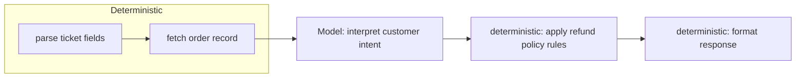

# Workflow Fundamentals — Senior

<!-- level-focus -->
At senior level, focus on this question:

> For a workflow that mixes deterministic code and model judgment, can you draw the exact boundary — which decisions the model makes, which decisions code makes — and defend why moving that boundary in either direction would make things worse?

---

## The determinism boundary is a design artifact, not an accident

- Every step in a workflow is either **deterministic** (same input always produces the same output — a database query, a regex, a fixed template) or **non-deterministic** (an LLM call whose output can vary).
- The determinism boundary is the line in your workflow diagram between the two. Draw it explicitly — don't let it be wherever an LLM call happened to get inserted.
- A well-drawn boundary puts the model exactly where a decision genuinely requires judgment (interpreting free text, choosing between ambiguous options) and nowhere else.

## Where non-determinism is load-bearing vs. accidental

- **Load-bearing**: the task genuinely cannot be solved by a fixed rule — interpreting an ambiguous customer message, deciding whether a written complaint counts as a valid refund reason.
- **Accidental**: the task was solvable deterministically, but got routed through the model out of convenience — computing a total, checking whether a date is in the past, applying a fixed threshold.
- Test: could you write a unit test with a fixed expected output for this step? If yes, it should be deterministic code, not a model call — a model call there is accidental non-determinism, and it makes the step untestable in the normal sense.

## Structured contracts across the boundary

- Every hop across the boundary — code calling the model, or the model's output feeding back into code — needs a structured contract, not a raw string.
- Model output crossing into code: require a schema (e.g., JSON with named, typed fields) so code can consume it without re-parsing free text.
- Code output crossing into the model: pass only the fields the model needs to reason about, not an entire raw record — extra fields it doesn't need add noise and cost.

## Hybrid workflows: deterministic skeleton, agentic pockets

- Build the overall workflow as a deterministic skeleton (chain or routing, from middle level) and drop a full agentic loop into only the specific pocket that needs it.
- Example: the refund workflow is a deterministic chain (validate ticket → fetch order → check policy) except for one pocket — "does this written explanation satisfy the policy's stated exception clause?" — which genuinely needs judgment and gets a model call with a structured yes/no + rationale contract.
- This bounds the blast radius of non-determinism: if the model behaves unexpectedly, only that pocket is affected, not the whole run.

## Cross-Component Scenario: Locating the Boundary in the Support Workflow

The routed ticket workflow from middle level, for the refund path:

1. **Deterministic**: parse the ticket, fetch the order record, check whether the order is within the refund window (a date comparison).
2. **Model (load-bearing)**: interpret the customer's stated reason and classify it against the policy's exception list — this genuinely requires reading free text.
3. **Deterministic**: given the model's structured classification, apply the fixed refund-amount rule (a lookup table, not a model decision).
4. **Deterministic**: format the final response from a template, filling in the amount and reason.

Only step 2 is non-deterministic — everything else is testable with fixed expected outputs.

## Common Mistakes

- **Letting the model do arithmetic or fixed comparisons "because it's already in the loop."** These belong in code — a model doing a fixed calculation is slower, costs more, and can be wrong in ways a formula cannot.
- **No schema on the model's output crossing back into code.** Free-text output that code then regex-parses is fragile and breaks silently when phrasing shifts.
- **Widening the agentic pocket "just in case."** Every extra step given to the model instead of code adds cost and unpredictability that isn't buying you anything if the step was already deterministic.

## Apply It

1. Take a workflow you've built or plan to build. Mark every step as deterministic or model-driven.
2. For every model-driven step, write the one sentence for why it's load-bearing (a fixed rule genuinely cannot solve it).
3. Write the structured contract (named, typed fields) for the model's input and output at that boundary.
4. Redraw the flowchart with the boundary explicit, and confirm the agentic pocket is as small as it can be.

## Verify Your Work

- Every model-driven step has a stated reason it can't be a fixed rule — not "it was easier this way."
- Every hop across the boundary uses a named, typed contract, not a raw string.
- The agentic pocket is the smallest one that still solves the task — you tried shrinking it and can say what broke when you did.

## Review Questions

- What test distinguishes load-bearing non-determinism from accidental non-determinism?
- Why does a schema matter more at the boundary between model and code than inside a single deterministic step?
- What does "deterministic skeleton, agentic pockets" bound, and why does that matter for reliability?
- What's the cost of letting the model do a task a fixed rule could have solved?
