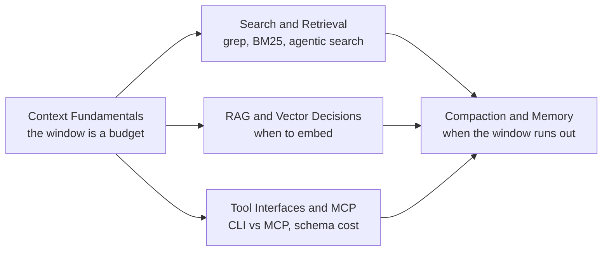

# Context Management

> Everything an agent knows at inference time is the tokens sitting in its context window. Context management is deciding what earns a slot in that window, how it gets there, and what it costs.

A model only reasons over what's in its context. Every retrieved document, every tool schema, every turn of history competes for the same fixed number of tokens. This section treats that window as an engineering budget, not a bottomless bucket: how much to spend, where to spend it, and what to cut when it runs out. The five subtopics build on each other in the order above — you can't decide when to reach for a vector database until you know grep and BM25 solve most retrieval problems for free, and you can't design compaction until you know what's actually occupying the window.

## Topics

| # | Topic | What you'll learn |
|---|-------|-------------------|
| 01 | [Context Fundamentals](context-fundamentals/junior.md) | What occupies the context window, budget allocation, context rot, and cache-friendly assembly. |
| 02 | [Search and Retrieval](search-and-retrieval/junior.md) | grep/glob as default tools, BM25 ranking by hand, agentic iterative search vs one-shot retrieval. |
| 03 | [RAG and Vector Decisions](rag-and-vector-decisions/junior.md) | What embeddings are, a decision framework for when RAG earns its cost, and diagnosing a broken retrieval pipeline. |
| 04 | [Tool Interfaces and MCP](tool-interfaces-and-mcp/junior.md) | What MCP actually is, MCP vs a CLI tool on token cost and control, and securing/governing a tool surface. |
| 05 | [Compaction and Memory](compaction-and-memory/junior.md) | What to do when a task outgrows the window — summarization, scratchpads, sub-agent isolation, long-horizon memory. |

## How to use this section

Each topic has four depth levels — **junior → middle → senior → professional**. Start at your level. Context Fundamentals is the foundation: every other topic assumes you already think in terms of "what's in the window right now and what did it cost." Search and Retrieval comes next because most context problems are solved by exact or lexical search before anyone needs an embedding — read it before RAG and Vector Decisions, which is the discipline of knowing when lexical search stops being enough. Tool Interfaces and MCP is a parallel concern: every tool schema is context too, whether or not it's ever called. Compaction and Memory is what you need once a single window can't hold a whole task, which is where the first four topics converge.

A single scenario threads through every subtopic: an **internal data-analyst agent** that answers questions like "why did GMV drop in Singapore last Tuesday?" against a BigQuery warehouse, a dbt repo, and a documentation corpus. It uses grep over the dbt repo, BM25 and hybrid retrieval over the docs, and the BigQuery MCP server (compared against the plain `bq` CLI) against the warehouse — then has to compact its findings when the investigation runs long.

For the loop that decides *when* to call a tool at all, see [Agent Workflow](../agent-workflow/). For measuring whether retrieval and context choices actually produce correct answers, see [Agent Evaluation](../agent-evaluation/).

## Practice rule

Before adding a retrieval system, a tool, or more history to an agent's context, write down what it costs in tokens and what it's replacing. If a `grep` or a `WHERE` clause already answers the question, an embedding index is a cost with no benefit.

---

> Part of the [AI Agent](../README.md) domain.
