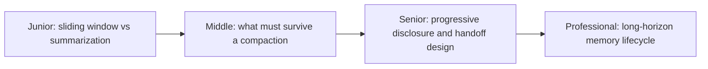

# Compaction and Memory

> A task that outgrows one context window doesn't have to end — but what survives the squeeze has to be chosen, not accidental.

## Levels

| Level | Guide | You are done when |
|---|---|---|
| Junior | [Sliding window vs. summarization](junior.md) | You can explain the trade-off between dropping old context and compressing it, and use a scratchpad file for offloaded state. |
| Middle | [What must survive a compaction](middle.md) | You can specify exactly what a summarization step must preserve for a real task, and design a sub-agent isolation boundary. |
| Senior | [Progressive disclosure and handoff design](senior.md) | You can design a fetch-on-demand context strategy and a structured handoff artifact between workflow phases. |
| Professional | [Long-horizon memory lifecycle](professional.md) | You can define what persists across runs, its retention/expiry policy, and its privacy boundary. |

## Practice rule

Before compacting or summarizing context, write down the specific decisions, constraints, and open questions the task depends on. After compacting, check that list is still recoverable from what remains — if it isn't, the compaction lost something load-bearing.

## Related

- [Context Fundamentals](../context-fundamentals/) — the budget that runs out, forcing a compaction decision in the first place.
- [Agent Workflow — State, Memory, and Durability](../../agent-workflow/state-memory-and-durability/) — what survives a process crash, a related but distinct concern from what survives a context compaction.
- [Search and Retrieval](../search-and-retrieval/) — the fetch-on-demand pattern this section's progressive disclosure builds on.
