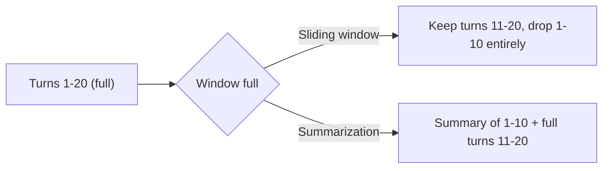

# Compaction and Memory — Junior

<!-- level-focus -->
At junior level, focus on this question:

> When a task's conversation history grows too large for the context window, can you tell the difference between simply dropping old turns and compressing them — and can you offload state to a file instead of carrying it all in context?

---

## Two basic strategies

- **Sliding window** — keep only the most recent N turns, drop everything older. Simple, cheap, but anything decided or discovered in a dropped turn is gone unless it was re-stated recently.
- **Summarization** — replace older turns with a shorter summary that captures what mattered, freeing up token budget while (ideally) keeping the important facts.



- Sliding window risks losing something load-bearing that was only ever said once, early on ("the user said the budget is capped at $500" said in turn 2, silently gone by turn 25).
- Summarization risks the summary itself dropping a detail because whatever produced it (often another model call) decided it wasn't important — which is a real risk, not a guarantee of safety, and needs checking (see middle level).

## The scratchpad-file pattern

For the data-analyst agent's long investigation ("why did GMV drop"), instead of keeping every intermediate SQL query and result in the conversation, write findings to a file as the investigation proceeds:

```
findings.md:
- Query 1: daily GMV by country, SG shows -18% on Tuesday
- Query 2: checked for pricing changes — none found in pricing_events table
- Hypothesis: check for a data pipeline gap, not a real GMV drop
```

- Keep only a **pointer** in context ("see findings.md for investigation log so far"), not the full accumulated history of every query and result.
- The agent can re-read the file when it needs the detail back, rather than the detail permanently occupying context space it isn't using most of the time.
- This is the same idea as [Search and Retrieval](../../search-and-retrieval/junior.md)'s "narrow, then fetch" — state lives outside context until it's actually needed, and even then in the specific span needed, not the whole file.

## Trace one compaction by hand

Given a 20-turn transcript of an investigation:

1. List every fact discovered in turns 1-10 that turn 20's final answer depends on.
2. Write a summary of turns 1-10 in 3-4 sentences.
3. Check: does your summary still contain every fact from step 1? If not, your summary would have caused a real failure had it replaced those turns.

## Comprehension check

- What's the concrete risk of a sliding window that just drops old turns entirely?
- What's the concrete risk of summarization, even though it sounds safer than dropping turns?
- In the scratchpad-file pattern, what stays in context and what moves to the file?
- Why is "keep a pointer to a file" cheaper on tokens than "keep the full accumulated history in the conversation"?
