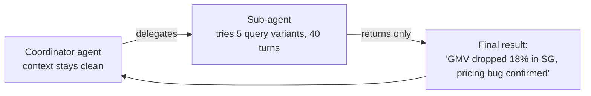

# Compaction and Memory — Middle

<!-- level-focus -->
At middle level, focus on this question:

> For a real task, can you specify exactly what a compaction step must preserve — not just "the important stuff" — and design a sub-agent as an isolation boundary that keeps its own noisy work out of the main context?

---

## Compaction triggers

Decide explicitly when compaction runs, rather than letting it happen implicitly whenever a framework default kicks in:

- **Token threshold** — trigger when conversation history crosses, say, 70% of its budget (see [Context Fundamentals](../../context-fundamentals/middle.md)), leaving headroom rather than triggering at 100% when there's no room left to even hold the summary.
- **Phase boundary** — trigger when a workflow moves from one phase to the next (e.g., "investigation" phase ends, "reporting" phase begins) — a natural point where full step-by-step history is no longer needed, only the conclusion.
- **Explicit request** — a long-running agent can be designed to compact on its own judgment when it recognizes the current phase is "done," rather than only being forced by a token limit.

## What must survive, named explicitly

Vague guidance ("summarize what's important") produces inconsistent summaries. Name the categories explicitly for the task type:

| Must survive | Why | Example |
|---|---|---|
| Decisions made | Re-deciding wastes turns and can produce a different (inconsistent) decision | "Decided to use SQL, not RAG, for the GMV number query" |
| Constraints stated | Silently violating an earlier constraint is a correctness bug, not just inefficiency | "User said: don't touch the `promotions` dataset, it's under a data freeze" |
| Open questions | Losing track of what's still unresolved makes the agent declare victory prematurely | "Still unconfirmed: whether the -18% is a real drop or a pipeline gap" |
| File/resource pointers | Detail can be re-fetched if the pointer survives, permanently lost if it doesn't | "Full query log: findings.md" |
| Explicitly **not** required | Verbatim prose is usually droppable if its conclusion was already captured | The literal back-and-forth phrasing of how a decision was reached |

A summarization prompt that says "preserve every decision, constraint, and open question, and note where full detail can be re-fetched" produces a categorically different (and checkable) result than "summarize this conversation."

## Sub-agent context isolation

Splitting work across a coordinator agent and one or more sub-agents (see [Orchestration and Delegation](../../agent-workflow/orchestration-and-delegation/)) is also a compaction strategy: a sub-agent's exploratory, noisy back-and-forth (e.g., trying five SQL query variants before finding the anomaly) stays entirely in the sub-agent's own context and never touches the coordinator's.

- The coordinator's context grows by one clean result, not by the sub-agent's entire noisy working process.
- This only works if the sub-agent's return value is itself well-specified (see senior level's handoff artifact) — a sub-agent that returns its own unstructured 40-turn transcript back to the coordinator defeats the whole point.

## Comprehension check

- Name three explicit triggers for when a compaction should run, rather than letting it happen implicitly.
- Give one example of a "constraint stated" that would be a correctness bug if lost during compaction.
- What's the difference between a summarization prompt that says "summarize this" and one that names required categories explicitly?
- Why does sub-agent delegation function as a compaction strategy for the coordinator's context?
