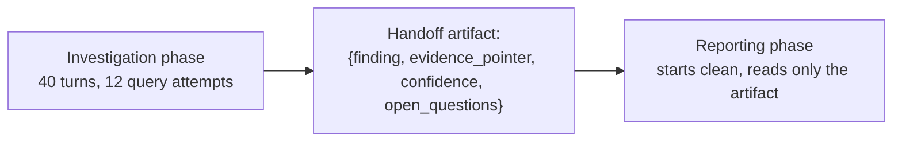

# Compaction and Memory — Senior

<!-- level-focus -->
At senior level, focus on this question:

> Can you design a fetch-on-demand ("progressive disclosure") context strategy and a structured handoff artifact between workflow phases — and detect when a compaction has caused a real regression, not just assume it's fine?

---

## Progressive disclosure: fetch on demand vs. pre-load everything

Two opposing defaults for giving an agent access to a large body of material:

- **Pre-load** — put everything potentially relevant into context up front (every table schema in the warehouse, every doc in the corpus). Simple, but pays the full token cost every turn whether or not most of it is ever used.
- **Fetch on demand** — give the agent a way to ask for exactly what it needs, when it needs it (`list_datasets` → `get_table_schema(table)` only for the one table it decided is relevant), paying token cost only for what's actually used.

For the data-analyst agent, pre-loading every table schema in a 200-table warehouse would exceed a reasonable budget before the investigation even starts; fetch-on-demand (via the MCP server from [Tool Interfaces and MCP](../../tool-interfaces-and-mcp/)) lets the agent look up only the 3 tables the investigation turns out to touch.

- The trade-off: fetch-on-demand costs extra round trips (latency) in exchange for token savings — worth it when the corpus is large and most of it is irrelevant to any single task; not worth it for a small, always-fully-relevant corpus (see the junior-level "does it fit already" check).

## Designing the handoff artifact

When one phase of a workflow (or one sub-agent) hands off to the next, the artifact that crosses that boundary is a design decision, not an afterthought:

- **Structured, not prose** — a JSON or well-defined markdown structure with named fields (`decision`, `constraints`, `open_questions`, `evidence_pointers`) is checkable and less lossy than a paragraph summary the next phase has to re-parse.
- **Complete enough to act on, not complete in raw detail** — the handoff should let the next phase proceed correctly without needing to re-derive anything, but it doesn't need every intermediate step that led there (that's what file pointers are for).
- **Versioned/schema-checked** — if a handoff artifact's shape changes, the consuming phase should fail loudly (schema mismatch) rather than silently misinterpreting a field that used to mean something else.

## Detecting compaction-induced regression

Don't assume a compaction step is safe just because it runs without erroring:

1. **Before/after eval** — run the same downstream task with and without a given compaction step (or with different summarization prompts) against a labelled eval set, the same discipline as [Context Fundamentals — Senior](../context-fundamentals/senior.md).
2. **Constraint-survival check** — for a task with known must-survive constraints (see middle level), explicitly check the post-compaction context still contains them; automate this as an assertion, not a manual spot-check, if the compaction runs frequently.
3. **Compare answer changes** — if the same query produces a different, worse answer after a compaction was introduced upstream in the transcript, that's a direct signal a load-bearing detail was lost — trace back to which compaction step dropped it.

## Comprehension check

- What's the core trade-off between pre-loading everything and fetching on demand, and when does fetch-on-demand not pay for itself?
- Why is a structured handoff artifact less lossy than a prose summary passed between workflow phases?
- What should happen when a consuming phase receives a handoff artifact that doesn't match the expected schema?
- Describe one concrete check you'd automate to catch a compaction step that silently drops a required constraint.
