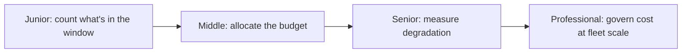

# Context Fundamentals

> The context window is a budget. Every token spent on one thing is a token not spent on another — spend deliberately.

## Levels

| Level | Guide | You are done when |
|---|---|---|
| Junior | [Count what's in the window](junior.md) | You can list every piece occupying context on one real turn and estimate its token cost. |
| Middle | [Allocate the budget](middle.md) | You can decide, before a turn runs, how many tokens each part of the context is allowed to use. |
| Senior | [Measure degradation](senior.md) | You can show, with a number, that a context change made answers better or worse — not just "it feels fine." |
| Professional | [Govern cost at fleet scale](professional.md) | You can set org-wide context budget policy and design for prompt-cache economics across many agents. |

## Practice rule

Before adding anything to context — a document, a tool schema, a turn of history — ask "what does this cost, and what does it replace?" If you can't answer both halves, don't add it.

## Related

- [Search and Retrieval](../search-and-retrieval/) — how the right small piece of text gets chosen instead of a whole document.
- [Tool Interfaces and MCP](../tool-interfaces-and-mcp/) — tool schemas occupy context whether or not they're ever called.
- [Compaction and Memory](../compaction-and-memory/) — what to do once the budget is exhausted mid-task.
