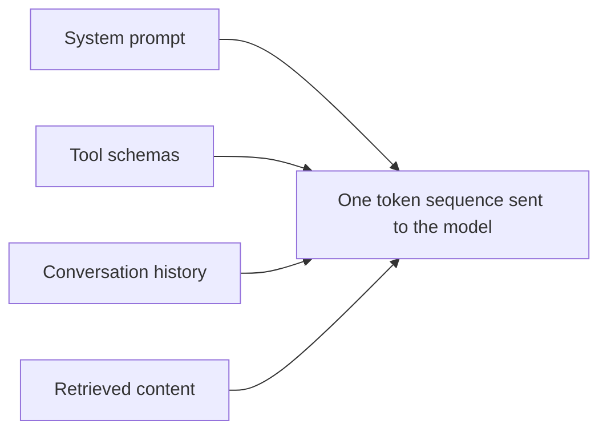

# Context Fundamentals — Junior

<!-- level-focus -->
At junior level, focus on this question:

> For one real turn of an agent, can you list everything sitting in the context window and roughly how many tokens each piece costs?

---

## What's actually in the window

Every request to the model is one flat sequence of tokens. It's not "the model has a system prompt and separately knows some facts" — everything is concatenated into one input:

- **System prompt / instructions** — the agent's role, rules, output format.
- **Tool schemas** — every tool the agent *could* call, whether or not it calls one this turn.
- **Conversation history** — every prior user message, model response, and tool result so far.
- **Retrieved content** — anything fetched by search/RAG for this turn.
- **The current user message** — the actual new input.

- A "200k context window" model doesn't reserve space per category — one bloated category (e.g., 40 tool schemas) shrinks room for everything else.
- Tool schemas cost tokens on **every** turn, even turns where no tool is called. A rarely-used tool with a verbose schema is a permanent tax.

## Count one turn by hand

For our data-analyst agent asking "what tables exist in the `sales` dataset?":

1. Write out the system prompt text — count words, divide by ~0.75 for a rough token estimate (1 token ≈ 0.75 words in English).
2. List every tool schema available to the agent (even unused ones) and estimate each schema's token cost.
3. List every message so far in the conversation.
4. Add the current user message.
5. Sum all four. Compare the sum to the model's stated context window (e.g., 200,000 tokens) to see what fraction is already spent before the model does anything.

Do this exercise once, by hand, on a real transcript. It's the fastest way to notice that "a huge context window" and "efficient context use" are unrelated claims.

## Context rot, in one sentence

A model's ability to use information degrades as the context fills up — not just because of a hard token limit, but because relevant details get harder to find and weigh among everything else present. This isn't a bug to route around later; it's a property to design against from the first turn. ([Chroma, "Context Rot" (2025)](https://research.trychroma.com/context-rot))

## Trace one bloat problem

Given a transcript where the agent's answer degrades after 15 turns of back-and-forth:

1. Identify which of the four categories above grew the most (usually: conversation history).
2. Ask: is every one of those 15 turns still relevant to the current question, or could 10 of them be dropped/summarized without losing anything the model needs?
3. Write one sentence naming what the agent needed to remember and one sentence naming what it didn't.

## Comprehension check

- Name the four things that occupy an agent's context window on a typical turn.
- Why does an unused tool still cost tokens on every turn?
- What does "context rot" mean, and why isn't a bigger window a fix for it?
- For a 10-turn conversation, which category is most likely to have grown the largest, and why?
