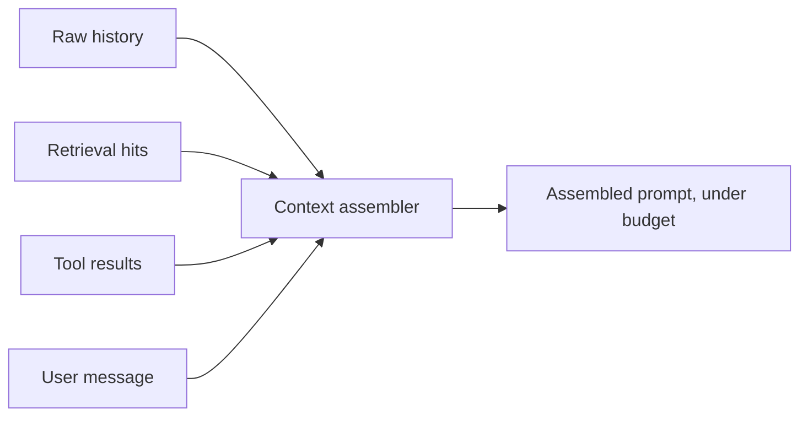

# Context Fundamentals — Senior

<!-- level-focus -->
At senior level, focus on this question:

> Can you show, with a measured number, that a specific context change made the agent's answers better or worse — instead of asserting it "should" help?

---

## Treat context assembly as a component, not a prompt string

At this level, the thing that builds the prompt for each turn is a piece of software with its own contract:

- **Input:** the raw materials — conversation history, retrieval hits, tool results, the user's message.
- **Output:** one assembled prompt, under budget, in a defined order.
- **Contract:** given the same inputs, produces the same output (deterministic assembly, even if the model's response isn't).

Treating it this way means it can be tested and versioned independently of the model — a regression in retrieved-content selection is a bug in this component, not a mysterious "the model got worse."

## Measure degradation, don't guess at it

Build a small eval set: 20-50 realistic queries for the data-analyst agent with known-correct answers, at a few different context fill levels (e.g., turn 1, turn 10, turn 30 of a running investigation). Run the same queries through and score answer correctness at each fill level.

- If accuracy drops as fill increases, that's context rot, quantified — not a vibe.
- Re-run the same eval after a context-assembly change (new truncation rule, new placement order, added summarization). A change that doesn't move the number didn't help, no matter how principled it sounded.
- Track the metric over time like any other regression suite — see [Agent Evaluation](../../agent-evaluation/) for the harness this plugs into.

## Diagnosing a live "context is the problem" complaint

When an agent's answers get worse deep into a long-running task, work top-down instead of guessing:

1. **Reproduce with the actual assembled prompt**, not the user's description of it. Log and inspect the literal prompt sent, not what you assume was sent.
2. **Check budget first** — did any category (history, retrieval) exceed its ceiling and get truncated in a way that dropped something load-bearing?
3. **Check placement** — is the critical instruction or fact now buried in the middle of a much longer prompt than in the passing case?
4. **Check for duplication** — long-running agentic loops often re-fetch and re-append the same tool result or file multiple times, quietly doubling its token cost with no new information.
5. **Compare token count, not just presence** — the fact wasn't dropped, but if the surrounding noise is 5x what it was in a passing run, wire up a truncation or summarization step (see [Compaction and Memory](../compaction-and-memory/)) before adding anything else.

## The determinism boundary for context assembly

Not everything about what goes into context should be left to the model. Decide explicitly:

- **Code decides:** budget ceilings per category, truncation order, prefix stability for caching, whether a tool result gets deduplicated.
- **Model decides:** what to say given the assembled context, and (within an agentic loop) what to search or fetch next.

A common failure is leaving "how much history to keep" as an implicit, undocumented behavior of whatever framework is in use, rather than an explicit, tested rule your team owns.

## Comprehension check

- What does it mean to treat context assembly as a component with a contract, and why does that make debugging easier?
- Design a two-line eval to check whether a truncation change improved or hurt answer quality — what do you measure it against?
- Walk through a five-step diagnosis for "the agent's answers got worse on turn 30 of a long investigation."
- Give one example of context duplication in an agentic loop and how you'd detect it in a logged transcript.
