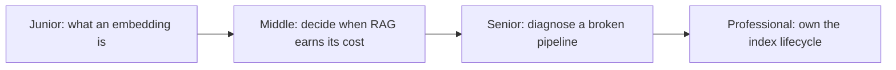

# RAG and Vector Decisions

> Ground a model in your own data — but only after checking that a cheaper tool (grep, SQL, or just fitting it in the prompt) wouldn't have solved the problem for less.

## Levels

| Level | Guide | You are done when |
|---|---|---|
| Junior | [What an embedding is](junior.md) | You can explain cosine similarity and trace the retrieve → augment → generate loop end to end. |
| Middle | [Decide when RAG earns its cost](middle.md) | You can use a decision framework to choose RAG, lexical search, SQL, or "just fits in the prompt" for a given case. |
| Senior | [Diagnose a broken pipeline](senior.md) | You can identify whether a bad answer came from a recall, precision, or faithfulness failure, with evidence. |
| Professional | [Own the index lifecycle](professional.md) | You can plan an embedding-model migration with no downtime and decide when to retire a RAG pipeline entirely. |

## Practice rule

Before adding a vector database, write down the query you expect it to answer that grep, BM25, and SQL cannot. If you can't name one, you don't need it yet.

## Related

- [Search and Retrieval](../search-and-retrieval/) — the lexical and hybrid techniques RAG sits on top of, and the ones to try first.
- [Context Fundamentals](../context-fundamentals/) — the token budget that caps how many retrieved chunks can be used per turn.
- [Agent Evaluation](../../agent-evaluation/) — the harness that measures whether a RAG change actually helped.
