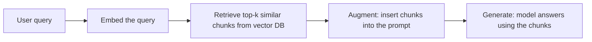

# RAG and Vector Decisions — Junior

<!-- level-focus -->
At junior level, focus on this question:

> Can you explain what an embedding and cosine similarity actually are, trace the retrieve → augment → generate loop end to end, and recognize when a question doesn't need any of this because it already fits in the prompt?

---

## What an embedding is

An embedding is a fixed-length list of numbers (a vector) produced by a model, meant to represent the *meaning* of a piece of text — two pieces of text with similar meaning produce vectors that are close together in that number-space, even if they share no exact words.

- "GMV dropped in Singapore" and "revenue declined in SG" can have very similar embeddings despite zero shared vocabulary — this is the paraphrase gap that [BM25](../../search-and-retrieval/middle.md) can't close.
- The embedding is produced once per document (at ingestion time) and once per query (at search time) — it is not the same as the text itself, and it can't be read back into words.

## Cosine similarity

Cosine similarity measures the angle between two vectors, ignoring their length — a score from -1 (opposite meaning) to 1 (identical direction/meaning), with 0 meaning unrelated.

```
similarity(A, B) = (A · B) / (|A| × |B|)
```

- Vector search means: embed the query, then find the stored document vectors with the highest cosine similarity to it.
- This finds semantically close text, not exact matches — the trade-off named in [Search and Retrieval](../../search-and-retrieval/).

## The RAG loop, traced



1. **Retrieve** — embed the incoming query, search a vector database for the most similar stored chunks.
2. **Augment** — insert those chunks into the prompt, usually with a note like "answer using only the following context."
3. **Generate** — the model produces an answer grounded in the inserted chunks, ideally citing which chunk supported which claim.

For the data-analyst agent: a question like "what's our policy on backfilling GMV after a pricing correction?" is answered by retrieving the relevant paragraph from a policy doc corpus and having the model answer from that paragraph — not from its own training data, which never saw this org's internal policy.

## The check that skips RAG entirely

Before building any of the above: does the relevant material already fit in the context window, in full, without retrieval? If the whole "policy doc corpus" is one 3-page document, just put the whole document in the prompt — retrieval adds indexing infrastructure and a chance of missing the right chunk, for zero benefit over "the model already has everything."

## Comprehension check

- What does an embedding vector represent, and why can two texts with zero shared words have a high similarity score?
- Write the retrieve → augment → generate loop in your own words, one sentence per stage.
- Give one example of a paraphrase pair a lexical search would miss but an embedding search would catch.
- Before building a RAG pipeline, what one question should you ask that might make the whole pipeline unnecessary?
