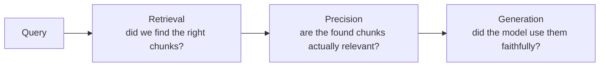

# RAG and Vector Decisions — Senior

<!-- level-focus -->
At senior level, focus on this question:

> Given a RAG system producing bad answers, can you determine — with evidence — whether the failure is in recall, precision, or faithfulness, rather than guessing at "the chunking must be wrong" and re-tuning at random?

---

## Three distinct failure stages

A RAG pipeline can fail at any of three independent points. Diagnosing the wrong one wastes time re-tuning a stage that was never broken.

| Failure | Symptom | Metric | Fix belongs in |
|---|---|---|---|
| **Recall failure** | The correct document exists in the corpus but never appears in retrieved results. | recall@k — is the known-correct doc in the top-k? | Retrieval: chunking, embedding model, hybrid weighting, index freshness. |
| **Precision failure** | Retrieved chunks include the right one, but buried among many irrelevant ones. | precision@k — what fraction of top-k are actually relevant? | Reranking, tighter top-k, better query formulation. |
| **Faithfulness failure** | The right chunk was retrieved and ranked well, but the model's answer contradicts or ignores it (hallucination on top of correct retrieval). | Faithfulness score — is every claim in the answer supported by the retrieved text? | Generation: prompt instructions, citation requirements, smaller/more targeted context per answer. |

## Diagnose with an eval set, not intuition

1. Build a labelled set: real queries, each with the known-correct source document(s) identified in advance.
2. Run retrieval alone and check recall@k — if the correct doc isn't even retrieved, the problem is upstream of the model; no prompt change will fix it.
3. If recall is fine but answers are still wrong, inspect what fraction of the *returned* chunks were actually relevant (precision) — a correct chunk drowned in 9 irrelevant ones can still cause a bad answer.
4. If recall and precision are both fine, check faithfulness — did the model's answer actually rely on the retrieved chunk, or did it answer from its own (possibly outdated or wrong) prior knowledge, ignoring the context it was given?
5. Only tune the stage the evidence points to. Retuning chunking to fix a faithfulness problem does nothing.

## The real cost of maintaining an index

An index isn't a one-time build — it's an ongoing liability:

- **Re-embedding on model change** — upgrading the embedding model means every existing vector is now on a different, incompatible scale/space; old and new vectors can't be mixed in one similarity search. This requires a full re-embed of the corpus, not an incremental patch.
- **Staleness** — a document edited after the last index run is invisible to retrieval until the next reindex; know your reindex cadence and whether it matches how fast the underlying data actually changes.
- **Drift** — as a corpus grows, embeddings that used to separate cleanly can start to cluster ambiguously; periodic re-evaluation against the eval set catches this before users do.
- **Infra cost** — a vector database, an embedding-inference endpoint, and a reindex pipeline are three services to operate, monitor, and pay for, on top of whatever lexical search already existed for free.

## Migrating an embedding model without downtime

1. Stand up the new embedding index alongside the old one (don't delete the old index yet).
2. Re-embed the full corpus into the new index in the background.
3. Run the eval set against both indexes; confirm the new one performs at least as well before cutting over.
4. Switch query traffic to the new index; keep the old one available briefly as a rollback path.
5. Decommission the old index only after the new one has run in production without regression.

## Comprehension check

- Given a bad answer, what's the first thing you check to distinguish a recall failure from a faithfulness failure?
- Why can't old and new embedding-model vectors be mixed in the same similarity search?
- Name three distinct ongoing costs of maintaining a vector index beyond the initial build.
- Outline the steps to migrate an embedding model with zero downtime and a rollback path.
