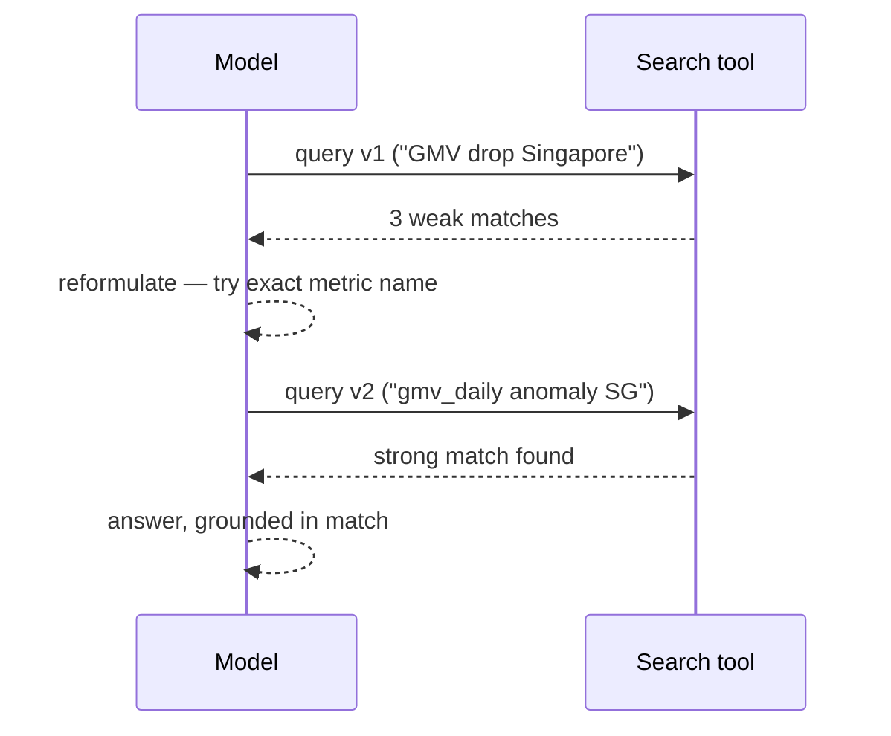

# Search and Retrieval — Senior

<!-- level-focus -->
At senior level, focus on this question:

> Can you design a search step as an iterative, agentic loop with a hybrid fusion strategy and a token budget — instead of one pre-retrieval call that hopes it got the right documents up front?

---

## One-shot retrieval vs. agentic search

- **One-shot (classic RAG-style) retrieval**: embed the query once, fetch top-k, hand it to the model, done. Works when the query is well-formed and the corpus is well-indexed.
- **Agentic search**: the model itself issues a search, reads what came back, decides the results don't answer the question, reformulates, and searches again — the same observe-reason-act loop from [Workflow Fundamentals](../../agent-workflow/workflow-fundamentals/), applied specifically to retrieval.

For the data-analyst agent, one-shot retrieval on the user's literal phrasing ("why did GMV drop") often misses a doc titled "gmv_daily anomaly runbook" — an agentic loop lets the model try the domain term after the plain-English query comes up empty, without a human intervening.

## Query rewriting and expansion

Before treating a null or weak result as "no answer exists," have the model (or a rule-based step) try:

- **Synonym/domain-term substitution**: "revenue drop" → "GMV decline", using known domain vocabulary.
- **Decomposition**: a compound question ("why did GMV drop and which team owns the fix") searched as two separate queries.
- **Broadening then narrowing**: a too-narrow query with zero hits relaxed one term at a time until something returns, then re-narrowed by re-ranking.

## Hybrid fusion, concretely

Run BM25 and vector search in parallel over the same corpus, then merge with **Reciprocal Rank Fusion (RRF)**: each result's fused score is the sum of `1 / (k + rank)` across the systems it appeared in (k is a small constant, commonly 60), so a document ranked highly by *either* system scores well, and one ranked highly by *both* scores best.

- This needs no score normalization between BM25 and cosine similarity (which aren't on the same scale) — RRF only uses rank position, sidestepping that problem entirely.
- Feed the fused top-k into a reranker (a smaller cross-encoder model scoring query-document pairs directly) before handing results to the model — rerankers are typically more accurate than either retrieval system alone but too slow to run over the whole corpus, so they only touch the already-narrowed candidate set.

## Budgeting search inside the loop

An agentic search loop can spiral: search, reformulate, search again, indefinitely. Bound it explicitly:

- **Max iterations** (e.g., 3 search attempts before falling back to "insufficient information" rather than looping forever).
- **Result budget per call** — cap tokens returned per search call (see [Context Fundamentals](../../context-fundamentals/)), so 3 rounds of search don't cumulatively blow the window even if each round alone was reasonable.
- **Dedup across rounds** — if round 2 returns a document already seen in round 1, don't re-spend tokens on it.

## Comprehension check

- What's the concrete difference between one-shot retrieval and agentic search, and what failure mode does agentic search fix?
- Why does RRF avoid the problem of BM25 and cosine-similarity scores being on different scales?
- What's a reranker for, and why doesn't it run over the whole corpus?
- Name two explicit bounds you'd put on an agentic search loop to prevent it from spiraling.
