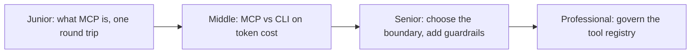

# Tool Interfaces and MCP

> A tool's real cost is measured in tokens, not lines of code — every schema sits in context on every turn, whether or not it's ever called.

## Levels

| Level | Guide | You are done when |
|---|---|---|
| Junior | [What MCP is, one round trip](junior.md) | You can explain MCP's client-server model and trace one tool call from discovery to result. |
| Middle | [MCP vs CLI on token cost](middle.md) | You can compare a CLI tool and an MCP server on token cost, control, and guardrails for a concrete case. |
| Senior | [Choose the boundary, add guardrails](senior.md) | You can decide which capabilities deserve a typed MCP server vs. a generic shell tool, with cost caps and failure semantics. |
| Professional | [Govern the tool registry](professional.md) | You can run a shared tool registry with schema versioning and security review at 100+ tools. |

## Practice rule

Before adding an MCP server or a new tool schema, ask what it costs on every turn it's *not* used, and what capability it adds that the model's existing tools (a shell, a CLI it already knows) don't already provide.

## Related

- [Search and Retrieval](../search-and-retrieval/) — search itself is usually exposed to the model as one of these tool interfaces.
- [Context Fundamentals](../context-fundamentals/) — the budget that tool schemas compete against, whether called or not.
- [Agent Workflow](../../agent-workflow/) — the loop that decides when to call a tool at all.
