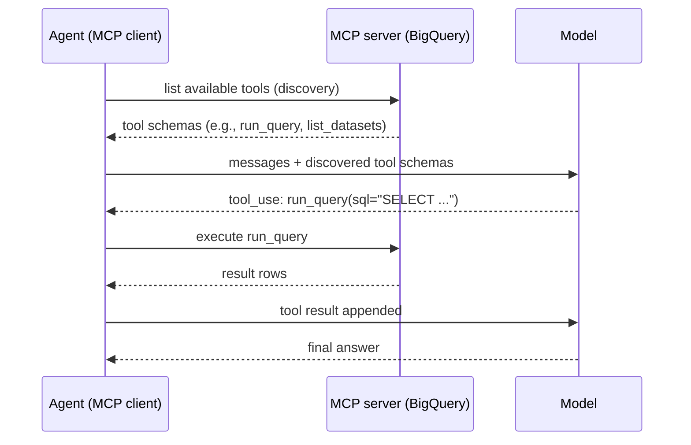

# Tool Interfaces and MCP — Junior

<!-- level-focus -->
At junior level, focus on this question:

> Can you explain what MCP actually is — a protocol, not a product — and trace one tool call from the model discovering it exists to a result coming back?

---

## What MCP is

The Model Context Protocol (MCP) is an open, standardized protocol for connecting an AI application to external tools, data sources, and prompts, through a client-server architecture. ([Model Context Protocol specification](https://modelcontextprotocol.io/))

- An **MCP server** exposes capabilities in three kinds: **tools** (actions the model can invoke, e.g., `run_query`), **resources** (data the client can read, e.g., a file or a dataset schema), and **prompts** (reusable prompt templates the server provides).
- An **MCP client** (the agent framework) connects to one or more servers, discovers what they expose, and makes those capabilities available to the model.
- **Transport** is the connection mechanism — commonly `stdio` (the server runs as a local subprocess, communicating over standard input/output) or HTTP-based (the server runs remotely, reachable over a network).
- The protocol standardizes *how* an agent discovers and calls tools/resources — before MCP, every agent framework and every tool integration used its own bespoke interface; MCP is a common contract so a server built once can be used by any compliant client.

## One round trip, traced

1. **Discovery** — at connection time, the client asks the server what it can do; the server returns its tool/resource/prompt schemas.
2. **Exposure** — the client includes those schemas in the model's available tools, the same way any function-calling schema is exposed to a model as a JSON tool definition.
3. **Invocation** — the model emits a structured call naming a tool and its arguments; the client routes this to the correct MCP server.
4. **Execution and result** — the server runs the actual operation (e.g., a BigQuery query) and returns a structured result to the client, which appends it to the conversation for the model to reason over.

## Why this matters for context, specifically

Every tool an MCP server exposes is discovered once per session and then occupies context on **every** subsequent turn as part of the available tool schemas — connecting to a server with 30 tools costs tokens on every turn even if the agent only ever calls 2 of them. This is the same tax as any other tool schema (see [Context Fundamentals](../../context-fundamentals/junior.md)); MCP doesn't make it free, it standardizes how the tool got there.

## Comprehension check

- What are the three kinds of things an MCP server can expose, and give one example of each.
- What problem does MCP's standardization actually solve, compared to a bespoke per-framework tool integration?
- Trace the four steps of one MCP tool call round trip in your own words.
- Why does connecting to an MCP server with 30 tools cost tokens even on a turn where none of them are called?
