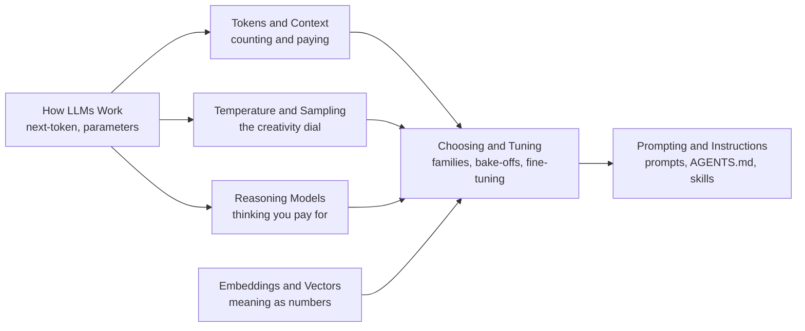

# LLM Fundamentals

> Seven concepts that explain what an LLM is actually doing between your prompt and its answer — what it is, what it costs, how to control its randomness, and how to instruct it — written for application developers, not model trainers.

## Subtopics

| # | Subtopic | What you'll learn |
|---|----------|-------------------|
| 01 | [How LLMs Work](how-llms-work/junior.md) | The next-token loop, what "7B" means, why the model never learns from your chat, and why hallucination is structural. |
| 02 | [Tokens and Context](tokens-and-context/junior.md) | Tokens vs. words, computing what a request costs, what fills the context window, and why effective context is smaller than advertised. |
| 03 | [Embeddings and Vectors](embeddings-and-vectors/junior.md) | How text becomes a list of numbers, cosine similarity, what you can build with it, and when keyword search is better. |
| 04 | [Temperature and Sampling](temperature-and-sampling/junior.md) | What temperature actually changes, why it makes output creative, and when creativity actively breaks your app. |
| 05 | [Reasoning Models](reasoning-models/junior.md) | How "thinking" works, why you pay for tokens you never see, and when reasoning is waste instead of accuracy. |
| 06 | [Choosing and Tuning](choosing-and-tuning/junior.md) | Claude, GPT/Codex, Gemini, GLM, and open-weight families by design intent — plus the prompt → RAG → fine-tune ladder. |
| 07 | [Prompting and Instructions](prompting-and-instructions/junior.md) | The five parts of a good prompt, and the principles behind AGENTS.md, CLAUDE.md, SKILL.md, and rule files. |

## How to use this section

Each subtopic has four levels — **junior → middle → senior → professional** — retargeted to the application developer: junior means you can use the concept correctly in one small app, middle means you can choose between options for a real product constraint, senior means you can diagnose and design under production constraints, professional means you can set standards for a team. Start at your level. Topics 01 and 02 are the foundation — everything else assumes you know what a token is and what the model is doing. Topics 03–05 can be read in any order after that. Topic 06 pulls the earlier concepts into model-selection decisions, and Topic 07 is the applied discipline of steering the model with written instructions.

For what to put *inside* the context window at production scale (retrieval pipelines, RAG decisions, compaction), continue to [Context Management](../context-management/). For measuring whether any of this actually works, see [Agent Evaluation](../agent-evaluation/).

## Practice rule

Before changing a prompt, a sampling parameter, or a model, name the specific failure you're fixing and the number that will tell you it worked. A change you can't measure is a guess wearing an engineering costume.

---

> Part of the [AI Agent](../README.md) domain.
