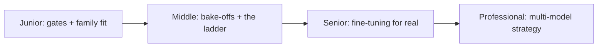

# Choosing and Tuning

> Which model should this task use? Answer the eligibility gates first, compare families by what they're built for, run your own small bake-off — and only climb the prompt → examples → RAG → fine-tune ladder when the rung below fails.

## Levels

| Level | Guide | You are done when |
|---|---|---|
| Junior | [Gates and family fit](junior.md) | You can run the eligibility checklist and match a task to a model family by design intent. |
| Middle | [Bake-offs and the ladder](middle.md) | You can run a small comparison on your own cases and know when each ladder rung is justified. |
| Senior | [Fine-tuning for real](senior.md) | You can judge when fine-tuning is right, prepare its data, and measure success with the right metrics. |
| Professional | [Multi-model strategy](professional.md) | You can set a model strategy that limits lock-in and handles new releases and retirements. |

## Practice rule

Leaderboard deltas are not evidence for your task. Ten real cases from your own data, graded against your own bar, beat any public benchmark comparison.

## Related

- [How LLMs Work](../how-llms-work/) — what parameters, distillation, and hosted-vs-open-weight mean for the choice.
- [Temperature and Sampling](../temperature-and-sampling/) — the settings that must travel with any model switch.
