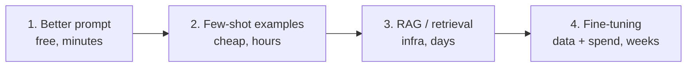

# Choosing and Tuning — Middle

<!-- level-focus -->
At middle level, focus on this question:

> Can you run a small, honest bake-off on your own cases — and know when each rung of the prompt → examples → RAG → fine-tune ladder is justified?

---

## The bake-off — your data, your bar

1. **Collect 20–50 real inputs** from your actual workload (real tickets, real documents) — not demo prompts. Include the hard and weird cases, not just typical ones.
2. **Write the quality bar first**: for each case, what does a correct output contain? Sealed before any model runs (the anti-bias discipline from [Evaluation Fundamentals](../../agent-evaluation/evaluation-fundamentals/)).
3. **Run each candidate model** with the *same* prompt and the settings you'd ship ([temperature matched to task](../temperature-and-sampling/)).
4. **Grade blind** where possible: outputs stripped of model names, judged against the written bar — by a human, or an [LLM judge calibrated against your labels](../../agent-evaluation/datasets-and-graders/middle.md).
5. **Report quality, latency, and cost together** — a quality win that triples latency may lose on the actual requirement.

## Why public leaderboards mislead

- They average across tasks you don't have, weighted by benchmarks you're not shipping — your narrow task can sit far from the aggregate.
- Benchmark contamination (test questions leaking into training data) inflates scores; your real inputs are guaranteed uncontaminated.
- Snapshot churn: leaderboard rows lag what the API actually serves.
- Use leaderboards for one thing only: generating the candidate list.

## The adaptation ladder — cheapest rung that works

- **Climb only when the current rung measurably fails.** Each rung up adds cost, complexity, and maintenance — and the lower rungs keep improving as models update.
- Rung 1 (prompt): role, constraints, output format, edge-case instructions. Fixes most "the model can't do X."
- Rung 2 (examples): few-shot demonstrations in the prompt — fixes style/format inconsistency, ambiguous task definitions.
- Rung 3 (retrieval): fixes *missing knowledge* — facts the model never had. Deliberation cannot fix this; only supplying the information can (see [Embeddings and Vectors](../embeddings-and-vectors/)).
- Rung 4 (fine-tuning): fixes *behavior* — consistent style/format, narrow-domain judgment, or cost reduction via a smaller tuned model. See [Senior](senior.md) for when it's genuinely right.
- The classic mis-climb: fine-tuning to add knowledge. It teaches behavior, not facts — knowledge belongs at rung 3.

## Common Mistakes

- **Testing with invented demo inputs.** They're cleaner, shorter, and easier than reality — the bake-off results won't transfer.
- **Comparing models with different sampling settings.** You measured settings, not models; match settings across candidates.
- **Grading while knowing which model produced what.** Brand knowledge contaminates judgment; blind the outputs.
- **Climbing the ladder for the wrong failure.** RAG for a style problem, fine-tuning for a knowledge gap — both burn weeks on the wrong rung.

## Apply It

1. Assemble 20–50 real inputs and write the sealed quality bar; include your hard cases deliberately.
2. Run the bake-off on 2–3 candidates with matched settings; report quality/latency/cost as one table.
3. For your current model complaint, name which ladder rung the failure belongs to — and confirm the current rung measurably failed before considering climbing.

## Verify Your Work

- Bake-off inputs are real workload samples, bar written before running.
- All candidates ran with identical prompts and settings; grading was blind.
- Any ladder climb cites a measured failure at the current rung.

## Review Questions

- Why must the quality bar be sealed before the bake-off runs?
- What failure belongs to rung 3, and why can't rung 4 fix it?
- Name two reasons a leaderboard delta might not transfer to your task.
