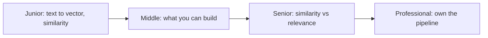

# Embeddings and Vectors

> An embedding turns text into a list of numbers that carries its *meaning*, so "how do I cancel" lands near "unsubscribe from my plan" even though they share no words. This subtopic is the concept: what vectors are, what they're good for, and how they fail.

## Levels

| Level | Guide | You are done when |
|---|---|---|
| Junior | [Text to vector](junior.md) | You can explain what a vector is, how text becomes one, and why cosine similarity measures relatedness. |
| Middle | [What you can build](middle.md) | You can name four things vectors enable, and when plain keyword search beats them. |
| Senior | [Similarity vs relevance](senior.md) | You can diagnose a vector search that returns similar-but-wrong results, with a metric. |
| Professional | [Own the pipeline](professional.md) | You can plan re-embedding migrations and decide when to retire a vector pipeline. |

## Practice rule

An embedding model is a *separate model* from your chat model — different vendor, different cost, different quality bar. Never assume your chat model's quality tells you anything about its embedding sibling.

## Related

- [RAG and Vector Decisions](../../context-management/rag-and-vector-decisions/) — the production retrieve→augment→generate pipeline and when RAG earns its cost.
- [Search and Retrieval](../../context-management/search-and-retrieval/) — the keyword techniques to try first.
