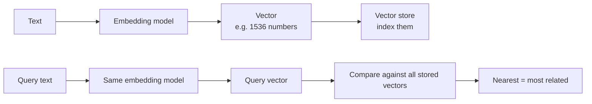

# Embeddings and Vectors — Junior

<!-- level-focus -->
At junior level, focus on this question:

> Can you explain how a sentence becomes a list of numbers, why that list captures *meaning*, and how cosine similarity compares two of them?

---

## The core idea: meaning as geometry

- An **embedding** is a list of numbers (a **vector**) produced by an **embedding model**, positioned so that texts with similar *meaning* get nearby vectors — regardless of shared words.
- "How do I cancel my subscription?" and "I want to unsubscribe from my plan" share almost no words but land close together, because the model learned from millions of examples what the concepts mean.
- Distance in this space ≈ semantic relatedness. That single property is the foundation of semantic search, dedupe, and RAG.

## The pipeline

- Two non-negotiables: the **same model** must embed documents and queries, and vectors from **different models are not comparable** — different coordinate systems entirely.
- The embedding model is **not your chat model**. It's usually smaller, cheaper, doesn't chat, and only turns text into vectors.

## Dimensions

- Each number in the vector is a **dimension**; models produce fixed widths (e.g., 384, 768, 1536, 3072).
- More dimensions can separate finer distinctions but cost more storage and compute. Width is a model property — you can't change it per request.

## Cosine similarity

- The standard way to score two vectors: the cosine of the angle between them.
- **1.0** ≈ pointing the same direction (same meaning), **0** ≈ unrelated, **−1** ≈ opposite.
- Ranking is all you need in practice: embed the query, compare against every stored vector, sort by score, take the top few.

## Common Mistakes

- **Embedding documents with one model and queries with another.** The scores are meaningless noise — the most common first-vector-project bug.
- **Treating the embedding model as "a smaller chat model."** It doesn't follow instructions or answer; it only vectorizes.
- **Comparing vectors across models or after re-embedding only some data.** Mixed-coordinate spaces return garbage rankings.
- **Expecting exact-keyword matching from vectors.** They capture relatedness, not presence — a rare product code may vanish; that's what keyword search is for.

## Apply It

1. Embed three texts — two paraphrases and one unrelated — and compute cosine similarity between all pairs; confirm the paraphrase pair scores clearly higher.
2. Embed the same text with two different models and confirm the vectors don't match in shape or comparability.
3. Build the smallest semantic search: embed 10 documents, embed a query, rank by cosine similarity, check the top result is right.

## Verify Your Work

- You can explain vectors as "meaning as position" without using the word "AI."
- Documents and queries go through the same embedding model — verified, not assumed.
- Your similarity scores are cosine, and ranking picks nearest first.

## Review Questions

- Why do "cancel my subscription" and "unsubscribe from my plan" end up near each other?
- Why must documents and queries use the same embedding model?
- What does a cosine similarity of 0.9, 0.5, and −0.1 suggest about three text pairs?
