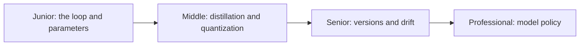

# How LLMs Work

> An LLM does one thing: predict the next token. Everything you experience — answers, code, apparent reasoning — is that loop run repeatedly. Understanding the loop explains the strengths, the costs, and the failure modes.

## Levels

| Level | Guide | You are done when |
|---|---|---|
| Junior | [The loop and parameters](junior.md) | You can explain next-token prediction, what "7B" measures, and why the model doesn't learn from your conversation. |
| Middle | [Distillation and quantization](middle.md) | You can explain why a distilled small model beats a generic one and the memory/quality trade of quantization. |
| Senior | [Versions and drift](senior.md) | You can protect an app from silent model upgrades and design for cheap model swaps. |
| Professional | [Model policy](professional.md) | You can write an org-wide policy for approved models, pinning, and upgrade evaluation. |

## Practice rule

When output surprises you, don't ask "why is it being difficult" — ask "what tokens did it see, and what is the most probable continuation of those tokens." The loop explains almost every weird answer.

## Related

- [Tokens and Context](../tokens-and-context/) — the unit the loop operates on, and what each one costs.
- [Temperature and Sampling](../temperature-and-sampling/) — how the "pick the next token" step gets its randomness.
