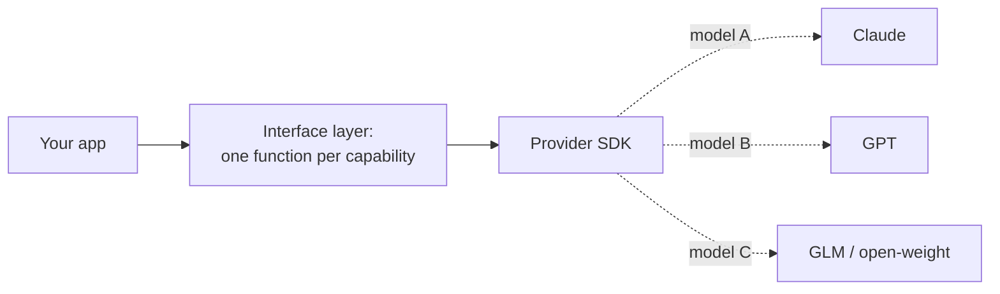

# How LLMs Work — Senior

<!-- level-focus -->
At senior level, focus on this question:

> Can you protect a production app from silent model changes, knowledge cutoffs, and capability-vs-reliability surprises — and make swapping models a small change instead of a rewrite?

---

## Versions drift under you

- Many API "model names" are aliases: `claude-sonnet-4` may point to a newer snapshot next month. Your app's behavior changes without a deploy on your side.
- Symptoms of an upstream change: output format shifts slightly, refusal behavior changes, token counts for identical prompts move, latency or cost per call changes.
- Defenses:
  - Pin to dated snapshots (`-20250115`-style suffixes) where the provider offers them.
  - Record the model version on every trace (see [Agent Evaluation](../../agent-evaluation/tracing-and-observability/)) so drift is diagnosable after the fact.
  - Run your golden set when your provider announces an update, not when users complain.

## Knowledge cutoff

- A model's facts end at its training cutoff — it knows nothing after that date, and may confidently describe stale information as current.
- Design rule: anything time-sensitive (prices, versions, "current" anything) must arrive as context — retrieved, from a tool — never trusted from parametric memory.
- Check the cutoff in the model card before using a model for anything factual.

## Capability ≠ reliability

- A model can be brilliant on a benchmark and still be unreliable for your narrow production task: inconsistent formatting, occasional instruction drift, surprising failure modes at low frequency.
- Benchmarks measure capability peaks; production cares about the worst 1% of calls. Evaluate with your own cases (see [Choosing and Tuning](../choosing-and-tuning/)) rather than trusting leaderboard deltas.

## Design for cheap model swaps

- Isolate provider specifics (SDK calls, message formats, tool-call syntax, error types) behind one thin interface your app code talks to.
- Keep prompts model-agnostic where possible; store per-model prompt variants as data, not scattered string edits.
- Log token usage and latency per call — the numbers you need to compare models are the ones you're already producing.

## Common Mistakes

- **No pinning, no trace versioning.** A behavior change reaches users before anyone knows the model changed underneath.
- **Trusting "the provider wouldn't change behavior" — they do, by design, when aliases update.**
- **Assuming the model knows recent events.** Cutoff-blind prompts produce confident stale answers.
- **Provider SDK calls scattered through app code.** Makes swapping or adding a fallback model a rewrite instead of a config change.

## Apply It

1. For your current provider calls: pin to snapshots where possible, and confirm the model version is recorded on every trace.
2. List the time-sensitive facts your app relies on; confirm each arrives via context (retrieval or tool), not parametric memory.
3. Find where provider SDK calls live in your code. If they're in more than one layer, define the single interface that should own them.

## Verify Your Work

- Model snapshots are pinned or their unpinned nature is a recorded, accepted risk.
- Every trace records which model version produced the output.
- All time-sensitive facts flow in as context, not from memory.
- Provider-specific code is confined to one replaceable layer.

## Review Questions

- Why can your app's behavior change without any deploy on your side, and what are the two defenses?
- Why must time-sensitive facts come from context rather than the model's memory?
- What's the difference between capability and reliability, and why do benchmarks measure only one?
