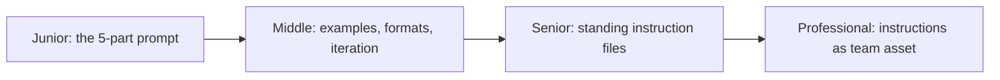

# Prompting and Instructions

> Two ways to steer a model: the prompt you send with each request, and the standing instructions that arrive with every request. This subtopic covers the craft of both — and the principles that decide what belongs where.

## Levels

| Level | Guide | You are done when |
|---|---|---|
| Junior | [The 5-part prompt](junior.md) | You can write a prompt with role, task, constraints, format, and examples — and know why vague prompts fail. |
| Middle | [Examples, formats, iteration](middle.md) | You can use few-shot examples, structured output, and a real-input iteration loop to make behavior consistent. |
| Senior | [Standing instruction files](senior.md) | You can apply the principles that make AGENTS.md/CLAUDE.md/SKILL.md files work — layering, brevity, verifiability. |
| Professional | [Instructions as team asset](professional.md) | You can govern instruction files: ownership, review cadence, drift detection, and bloat control. |

## Practice rule

Every instruction — in a prompt or a standing file — competes for the model's attention. If a rule isn't load-bearing enough to state precisely, it isn't load-bearing enough to include.

## Related

- [Context Engineering](../../context-management/context-fundamentals/) — the token budget every instruction spends from.
- [Datasets and Graders](../../agent-evaluation/datasets-and-graders/) — how to prove a prompt change helped instead of just feeling better.
