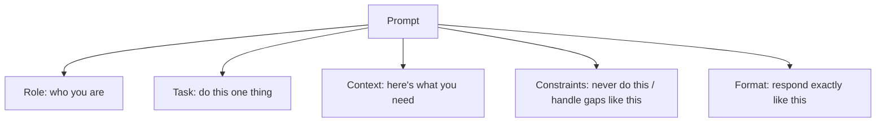

# Prompting and Instructions — Junior

<!-- level-focus -->
At junior level, focus on this question:

> Can you write a prompt with the five parts every effective prompt has — and explain why vague instructions produce vague output?

---

## The five parts

1. **Role**: who the model is — "You are a support agent for an e-commerce company." Focuses vocabulary and tone.
2. **Task**: the one thing to do, stated as an action — "Classify this ticket into exactly one category." One prompt, one primary task.
3. **Context**: what the model needs to know for *this* request — the ticket text, the customer's plan tier. Only what's needed; context costs tokens on every call (see [Tokens and Context](../tokens-and-context/)).
4. **Constraints**: the boundaries — what to do, what never to do, how to handle missing information ("If the order ID is missing, ask for it; don't guess").
5. **Output format**: exactly what the response should look like — "Reply with JSON: {category, confidence}" — or "Reply in 2 sentences maximum."

## Why vague prompts fail — the probability view

- The model predicts the most *plausible* continuation of what you wrote. A vague prompt is compatible with many continuations; the model picks one, and it may not be yours.
- "Summarize this" → plausible for a paragraph, a bullet list, a tweet-length gist — the model guesses your intent. "Summarize in 3 bullet points, each under 15 words, for a busy manager" → one dominant continuation.
- **Specificity isn't pedantry — it's how you collapse the distribution onto the output you actually want.**

## Show, don't tell

- "Be concise" is weaker than "Reply in 2 sentences maximum."
- "Don't be verbose" is weaker than a one-line example of the desired length and shape.
- Models copy patterns better than they follow abstractions — one concrete example outweighs three adjectives.

## Common Mistakes

- **One vague instruction doing five jobs.** "Write a good email" — good how, to whom, about what, how long?
- **Burying the task mid-paragraph.** Put task and format where they're unmissable (first or last, not the middle of a wall of context).
- **Constraints without gap-handling.** Telling the model what to do on happy paths only; unstated edge behavior gets improvised.
- **Politely hoping.** "Please try to maybe..." — instructions are specifications; hedged wording yields hedged compliance.

## Apply It

1. Take one prompt you use; label every sentence with its part (role/task/context/constraint/format) — and write the missing parts.
2. Rewrite its vaguest instruction as a concrete, checkable rule ("be concise" → "2 sentences max").
3. Run both versions on 3 real inputs and compare outputs against your intent.

## Verify Your Work

- The prompt has all five parts, each doing one job.
- Every abstract instruction ("good", "concise", "professional") is replaced by something checkable.
- The format section describes the exact response shape, including the edge cases.

## Review Questions

- Why does a vague prompt produce unpredictable output, in probability terms?
- Why is "2 sentences max" stronger than "be concise"?
- Which two prompt parts do people most often omit, and what does each omission cost?
