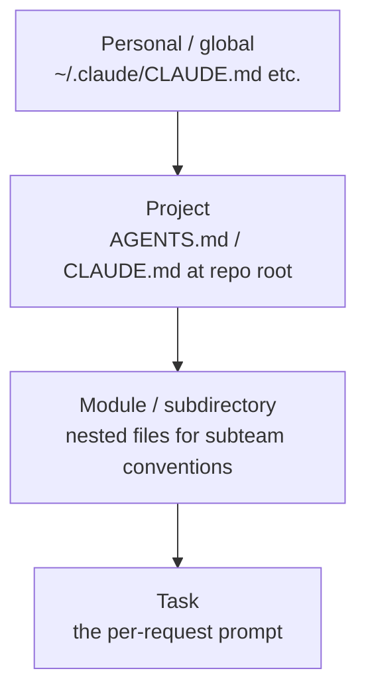

# Prompting and Instructions — Senior

<!-- level-focus -->
At senior level, focus on this question:

> Can you apply the principles that make standing instruction files — AGENTS.md, CLAUDE.md, SKILL.md, rule files — actually work: what belongs in them, layering, brevity, and verifiability?

---

## What standing instruction files are

- Files loaded into the model's context on every relevant request, without being part of any single prompt:
  - **AGENTS.md**: repo-level instructions for coding agents — the emerging cross-tool convention (used by OpenAI Codex, and honored by many tools).
  - **CLAUDE.md**: Claude Code's project memory — same idea, Claude-specific loading, often committed at repo root (and `~/.claude/CLAUDE.md` for personal-global rules).
  - **SKILL.md**: a packaged capability — instructions plus supporting files, loaded *on demand* when the task matches (Claude/agent skills), so it costs context only when used.
  - **Rule/config files**: tool-specific behavior rules (`.cursorrules`, lint-and-style guides for agents).
- The shared principle: they are **standing instructions** — present in context whether or not any given task needs them.

## Principle 1 — the scope test: what belongs where

- **Per-request prompt**: things specific to *this* task — the data, the one-off constraint, the particular output needed now.
- **Standing file**: things true for *every* task in scope — build commands, code conventions, review checklist, "never commit secrets," branch naming.
- The dividing question: *"Is this true every time, or just now?"* — every-time goes in the file, just-now stays in the prompt.

## Principle 2 — brevity is a cost property, not a style preference

- Standing files spend tokens on **every** call in scope; a bloated AGENTS.md taxes every single task, whether or not its rules apply.
- Every line competes for the model's attention — a 400-line file of "always do X" rules means each individual rule is followed *less* reliably, not more. Instruction-following degrades as instruction count grows.
- Working discipline: hard cap the file length; each rule earns its place by frequency × importance — how often it applies times how much it matters. Niche rules move into SKILL.md-style on-demand files.
- Say it once, precisely: ten overlapping rules about commit style yield worse compliance than one exact rule.

## Principle 3 — verifiable rules only

- Weak: "write good commit messages." Strong: "commit format: `type(scope): summary`, imperative, under 72 chars — e.g. `fix(auth): handle expired refresh tokens`."
- The test: could the model (or a teammate) *check* compliance from the text alone? If compliance is a matter of taste, it's unenforceable — models will interpret it loosely, differently each time.
- Convert every "always/never" you write into its checkable form: name the command, the format, the exact boundary.

## Principle 4 — layering, explicit precedence

- Rules live at the narrowest scope that makes them true: personal preferences at global level, team conventions at repo level, subsystem quirks in nested files, one-off needs in the prompt.
- When rules conflict, later/more-specific should win — and you should *know* your tool's actual precedence order rather than assume it. Conflicting rules across layers is a common source of "the model ignores my instructions."

## Principle 5 — instructions decay

- Codebases change; standing files don't follow automatically. A stale AGENTS.md (*"run `npm test`"*, but the repo moved to pnpm) actively misleads the model every single day.
- Treat instruction files as code: review them in PRs that change what they describe (build system, conventions, directory layout), and prune rules that no longer match reality on a schedule.

## Common Mistakes

- **The brain-dump file.** Everything the team ever told the model, accumulating forever — each added rule taxes and dilutes all the others.
- **Task-specific instructions in standing files.** "When handling refund emails..." inside global memory taxes every unrelated task.
- **Aspirational rules.** "Write comprehensive tests" — unverifiable, interpreted differently each run; name the command and the coverage bar or cut it.
- **Untracked files.** Not in version control → no review, no history, drifts silently per developer.
- **Assumed precedence.** Layering global + project + nested files without knowing which wins on conflict.

## Apply It

1. Audit one standing instruction file: mark each rule every-time vs. just-now; move the just-now rules out.
2. Rewrite every unverifiable rule in checkable form — exact command, format example, numeric boundary.
3. Check layering: is anything in the global file that's only true for one repo (or vice versa)? Move each rule to its narrowest true scope.
4. Add the file to version control if it isn't, and put "instruction files" on the review checklist for build/convention PRs.

## Verify Your Work

- Every rule in the standing file passes the every-time test.
- Total length is capped, and each rule survives the frequency × importance test.
- Every rule is checkable from text alone — no taste-based compliance.
- Precedence across layers is known and conflicts have been eliminated.

## Review Questions

- What question separates standing-file content from per-request prompt content?
- Why does a 400-line instruction file produce *worse* rule-following than a 40-line one?
- What makes "write good commit messages" unenforceable, and what's its enforceable form?
