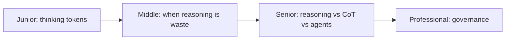

# Reasoning Models

> Some models generate internal "thinking" tokens before answering — working through the problem step by step, then giving you the result. You pay for every thinking token, in money and seconds. Sometimes that's the best money you'll spend; often it's pure waste.

## Levels

| Level | Guide | You are done when |
|---|---|---|
| Junior | [Thinking tokens](junior.md) | You can explain how a reasoning model works, why you pay for invisible tokens, and what tasks they help. |
| Middle | [When reasoning is waste](middle.md) | You can classify your tasks into reasoning-helps vs. reasoning-wastes, and explain the temperature interaction. |
| Senior | [Reasoning vs. CoT vs. agents](senior.md) | You can choose between a reasoning model, prompt-level CoT, and an agent loop — and cap the budget. |
| Professional | [Governance](professional.md) | You can decide which product surfaces may use reasoning models and measure whether it pays off. |

## Practice rule

Before reaching for a reasoning model, ask: does this task fail because the model can't figure it out, or because it doesn't have the information? Reasoning helps the first; the second needs retrieval or tools.

## Related

- [How LLMs Work](../how-llms-work/) — the loop thinking tokens extend.
- [Temperature and Sampling](../temperature-and-sampling/) — why reasoning and high temperature fight each other.
