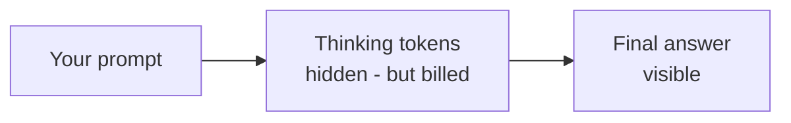

# Reasoning Models — Junior

<!-- level-focus -->
At junior level, focus on this question:

> Can you explain what a reasoning model does differently, why you pay for tokens you never see, and which tasks actually benefit?

---

## What "reasoning" actually is

- A **reasoning model** (e.g., a Claude extended-thinking class, an OpenAI o-class, Gemini thinking variants, GLM's thinking modes) generates **thinking tokens** before the final answer: it works through the problem — trying steps, catching its own mistakes, backtracking — then writes the answer.
- It's still the same next-token loop from [How LLMs Work](../how-llms-work/) — the model just runs many private iterations of it before producing tokens you see. Not a different kind of intelligence; more compute spent before answering.

## The bill for invisible work

- Thinking tokens are **billed as output tokens** — typically several times the price of input tokens — and they add **seconds to minutes** of latency.
- They often outnumber the visible answer by a large multiple: a 200-word answer can carry 2,000 tokens of thought.
- Check the usage fields in every response: `reasoning_tokens` (or equivalent) is the line item that surprises people on the invoice.

## Where reasoning earns its cost

- **Multi-step logic**: math, puzzle-like problems, scheduling with constraints — tasks where the first plausible answer is usually wrong and checking steps pays.
- **Planning**: breaking a fuzzy goal into ordered sub-tasks before acting.
- **Hard debugging/troubleshooting**: reasoning over evidence to form and discard hypotheses.
- The common thread: the task rewards *thinking before answering*, and the cost of a wrong answer exceeds the cost of the extra tokens.

## Where it's just slow and expensive

- Extraction, reformatting, classification, simple lookups, chat replies — tasks whose difficulty is in *knowing*, not *figuring out*. A standard model at temperature 0 matches quality at a fraction of cost and latency.

## Common Mistakes

- **Reaching for a reasoning model because the task is "important."** Importance ≠ difficulty; reasoning pays off only when the task needs deliberation.
- **Not looking at reasoning-token counts.** The bill quietly runs 5–10× the visible output; nobody notices until the invoice.
- **Using it for latency-sensitive interactive paths.** Extra seconds of thinking are visible to users waiting on a chat reply.
- **Assuming reasoning fixes factual gaps.** If the model doesn't know the fact, thinking longer produces *confidently reasoned* nonsense — the gap needs data, not deliberation.

## Apply It

1. Take one task you're considering a reasoning model for; state whether it fails from lack of * figuring-out* or lack of *information* — the answer decides the model class.
2. Run one real task on both a standard and a reasoning model; compare answer quality, latency, and (from usage fields) cost including hidden tokens.
3. Find the reasoning-token field in your provider's response format and locate it in your most recent bill's math.

## Verify Your Work

- You can explain thinking tokens as more loop iterations — not a new capability category.
- Any reasoning-model choice cites "needs deliberation," with a cost/latency number attached.
- Hidden-token cost is computed from usage fields, not guessed.

## Review Questions

- What are thinking tokens, and why are they billed as output?
- Name two task shapes where reasoning earns its cost and two where it's waste.
- Why doesn't "thinking harder" fix a missing-fact problem?
