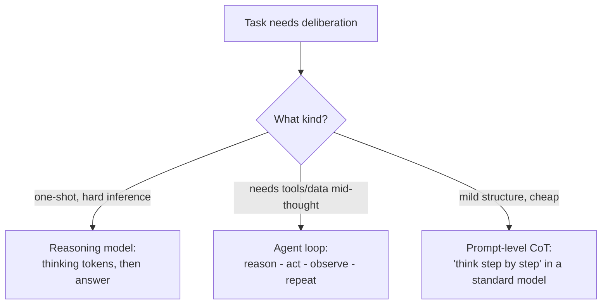

# Reasoning Models — Senior

<!-- level-focus -->
At senior level, focus on this question:

> Can you choose between a reasoning model, prompt-level chain-of-thought, and an agent loop for a real task — and cap the reasoning budget so it can't run away?

---

## Three ways to get deliberation — pick deliberately

- **Prompt-level chain-of-thought (CoT)**: ask a standard model to "think step by step" in its visible output. Cheap, inspectable — the thinking is right there in the text. Limited: the model can't backtrack, and long CoT eats your output tokens and context.
- **Reasoning model**: private, longer, better-at-backtracking deliberation. Costs more, hides its work (you see conclusions, not the chain — unless surfaced), adds latency.
- **Agent loop**: interleaves reasoning with *actions* — call a tool, observe the result, reconsider. This is the right shape when deliberation needs new information mid-task (the workflow mechanics are [Agent Workflow](../../agent-workflow/)'s subject).
- The overlap trap: an agent loop whose steps each run a reasoning model is deliberation inside deliberation — enormous cost, and usually worse, because inner thinking delays the observation that would have corrected it.

## Over-thinking and under-thinking

- **Over-thinking**: the model deliberates extensively on a trivial task — 2,000 thinking tokens to format a date. Sign: reasoning-token counts wildly exceed task difficulty; quality identical to a standard model.
- **Under-thinking**: effort set too low for genuine difficulty — the model "decides" fast and gets the multi-step case wrong. Sign: failures cluster on the hardest inputs only.
- Both are tuning errors on the effort dial: watch the correlation between task difficulty, thinking tokens spent, and correctness — outliers in both directions are the dial being wrong.

## Capping the budget

- Never ship an uncapped reasoning path: set a **max thinking-token budget** (or effort level) per task, and define behavior on breach — return best-so-far, degrade to the standard model, or fail to a fallback path.
- Track the distribution of thinking tokens per task in traces (see [Tracing and Observability](../../agent-evaluation/tracing-and-observability/)); a fat tail means some inputs are quietly consuming multiples of your budget assumption.

## Model-version sensitivity

- Reasoning behavior is more version-sensitive than standard generation: a new model snapshot can shift how much it thinks, how it structures chains, and therefore cost and latency — for identical prompts and settings.
- Re-run your reasoning eval set on every model update, watching cost and latency as first-class metrics alongside quality (the upgrade-evaluation discipline is [How LLMs Work — Senior](../how-llms-work/senior.md)).

## Common Mistakes

- **Reasoning model inside every agent step.** Compounding deliberation: slower, costlier, and often less accurate than acting-then-observing.
- **CoT confused with reasoning models.** "Think step by step" in a visible answer is a cheaper, weaker tool — know which one your task needs.
- **No breach behavior defined.** An input that sends thinking into the stratosphere holds your latency and budget hostage.
- **Model updates evaluated on quality alone.** Reasoning-token growth is a cost regression that quality-only checks never see.

## Apply It

1. For each deliberation-needing task, decide reasoning model vs. CoT vs. agent loop — write the one-line reason in the task's config.
2. Plot thinking-token distribution per task; investigate both tails (over- and under-thinking) and adjust effort per the evidence.
3. Define and implement breach behavior (budget cap → degrade or fall back) for every reasoning path.
4. Add cost/latency deltas to the checklist for evaluating any model snapshot update on reasoning tasks.

## Verify Your Work

- Every deliberation path names its mechanism (RM/CoT/loop) with a reason — no defaults by inertia.
- Thinking-token distributions are tracked, and both tails have been investigated.
- No reasoning path ships without a budget cap and defined breach behavior.

## Review Questions

- Why is "reasoning model inside each agent step" usually worse than the loop alone?
- What trace signal distinguishes over-thinking from under-thinking, and what fixes each?
- Why must breach behavior be defined before shipping a capped reasoning path?
