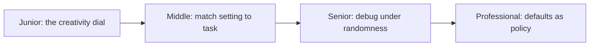

# Temperature and Sampling

> After scoring every possible next token, the model has to *pick* one. Temperature is the dial that controls how adventurous that pick is — and it's the entire mechanism behind "creative" vs. "boring" LLM output.

## Levels

| Level | Guide | You are done when |
|---|---|---|
| Junior | [The creativity dial](junior.md) | You can explain what temperature reshapes, why high settings feel creative, and what top-p does. |
| Middle | [Match setting to task](middle.md) | You can assign a setting per task type and explain why high temperature breaks tool calls. |
| Senior | [Debug under randomness](senior.md) | You can tell a temperature bug from a prompt bug and test non-deterministic behavior properly. |
| Professional | [Defaults as policy](professional.md) | You can set org-wide sampling defaults and stop creative settings leaking into deterministic paths. |

## Practice rule

Before blaming a prompt or a model for a weird output, check the sampling settings. Half of "the model is random" bugs are a temperature setting someone set once for a demo.

## Related

- [How LLMs Work](../how-llms-work/) — the next-token loop this dial sits inside.
- [Reasoning Models](../reasoning-models/) — why reasoning tasks especially dislike high temperature.
