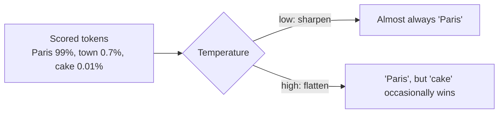

# Temperature and Sampling — Junior

<!-- level-focus -->
At junior level, focus on this question:

> Can you explain what the model does after scoring all possible next tokens — and what exactly temperature changes about that choice?

---

## The pick, not the guess

- At each step the model produces a **probability** for every token in its vocabulary: "after 'The capital of France is', *Paris* gets ~99%, *the* ~0.5%, *a* ~0.01%…"
- Something must still choose one token from that distribution. **Sampling** is that choice procedure, and its settings are the knobs.

## Temperature — flattening or sharpening the odds

- **Temperature** rescales the distribution before the pick:
  - **Low (≈0–0.3)**: sharpens it. High-probability tokens dominate; the model almost always takes the likely word. Output is predictable, repetitive, "boring."
  - **High (≈0.8–1.5)**: flattens it. Unlikely tokens get a real chance of being picked. Surprising word choices, varied phrasing, unexpected associations — output feels **creative**.
- That's the entire mechanism. "Creativity" is not a mode the model enters — it's unlikely tokens winning the pick more often.

- **Temperature 0** means "always pick the single most likely token." Note: it's *near*-deterministic in practice — provider-side batching and hardware variance mean identical prompts can still differ slightly.

## Top-p and top-k — the supporting knobs

- **Top-p (nucleus)**: sample only from the smallest set of tokens whose probabilities sum to p (e.g., top-p 0.9 → the most likely tokens covering 90% of the mass), then temperature applies within that set. It cuts off the truly absurd tail.
- **Top-k**: same idea with a fixed count — only the k most likely tokens are candidates.
- Rule of thumb: tune **temperature** for flavor; use top-p/top-k as a safety net against nonsense, not as the main dial.

## Common Mistakes

- **Thinking "creative mode" is a different model behavior.** Same model, same probabilities — only the pick procedure changed.
- **Raising temperature to fix a quality problem.** If outputs are wrong, more randomness makes them wrong more variably, not more correct.
- **Assuming temperature 0 is bit-identical every run.** It's near-deterministic; don't build tests that demand byte-identical output.
- **Leaving demo settings in production code.** The 1.2 you tried for a fun demo is now your invoice-processing prompt's setting.

## Apply It

1. Send the same prompt at temperature 0, 0.7, and 1.3, three times each; observe the spread of outputs and relate each to the distribution you now know is underneath.
2. Find every sampling setting in your current code and write down why each value is what it is.
3. Deliberately break a structured-output call with high temperature; watch invalid JSON or wrong tool arguments appear.

## Verify Your Work

- You can explain "creative" as unlikely tokens winning more often — no hand-waving.
- Every sampling value in your code has a written reason.
- You've seen, firsthand, high temperature corrupt structured output.

## Review Questions

- What does temperature do to the token distribution, in one sentence?
- Why does temperature 0 not guarantee identical outputs?
- How do top-p and top-k differ, and which one is the "flavor" dial?
