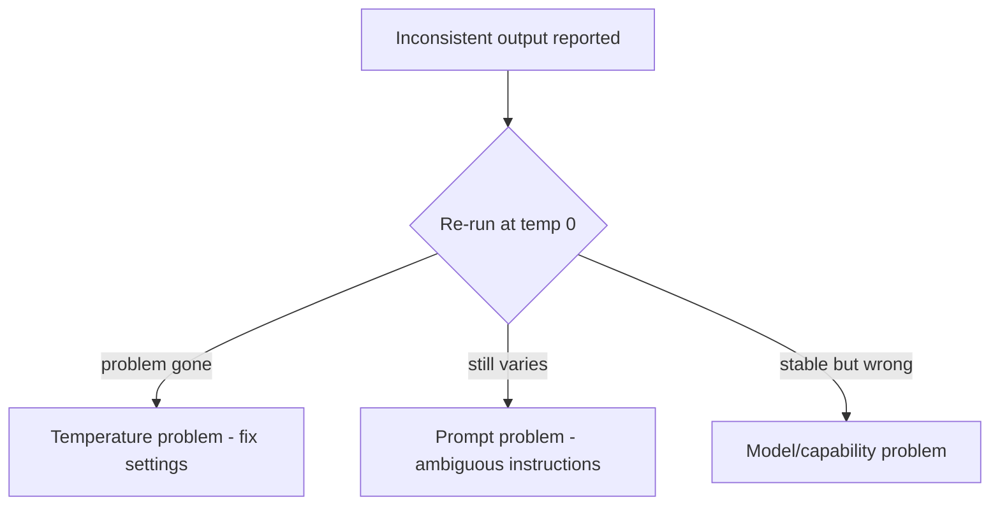

# Temperature and Sampling — Senior

<!-- level-focus -->
At senior level, focus on this question:

> Can you tell a temperature problem apart from a prompt problem, and test behavior that is genuinely random without fooling yourself?

---

## Debugging: three causes, three signatures

When output is "inconsistent," classify before fixing:

- **Temperature problem**: the *same* input yields varied outputs, and at temperature 0 the problem mostly disappears. Fix: settings, not prompts.
- **Prompt problem**: outputs are varied *and wrong in the same way* regardless of temperature — an ambiguous instruction gets misread a hundred ways. Fix: the prompt (see [Prompting and Instructions](../prompting-and-instructions/)).
- **Model problem**: even at temperature 0 the failure persists with a stable, wrong answer. Fix: different model, more context, or tool support.

- The temp-0 re-run is the cheapest diagnostic in LLM engineering: one call, and it splits the space into thirds.

## Testing under non-determinism

- **Don't** assert exact-match output at any temperature above 0 (and don't demand byte-identity even at 0).
- **Do**: run each case N times (3–10) and assert on the *rate* — "parses as valid JSON in ≥95% of runs," "contains the refund amount in all runs."
- Deterministic graders over rate-based assertions catch the real regressions while tolerating legitimate variation (the mechanics are in [Datasets and Graders — Senior](../../agent-evaluation/datasets-and-graders/senior.md)).

## Seeds — when "repeatable" is actually needed

- Some providers accept a **seed** parameter: same seed + same prompt + same settings → highly similar outputs. Useful for debugging a specific bad output and for comparable A/B runs.
- Limits: seeds are best-effort (provider batching can still vary results slightly), and a seed is not a determinism guarantee you can build contracts on.
- For genuine reproducibility requirements, prefer caching the output itself over trusting seeds.

## Common Mistakes

- **Fixing a temperature problem with prompt edits.** You'll soften one symptom and the variance remains — settings were the cause.
- **One failing run = bug report.** At temperature 0.7, one bad run out of ten is the system working as configured; look at rates.
- **Asserting exact strings in CI.** The suite flakes, engineers start re-running to green, and the gate loses all meaning.
- **Treating a seed as a determinism contract.** Best-effort reproducibility, not a guarantee.

## Apply It

1. Take your flakiest output complaint; run its input at temperature 0 five times and classify: temperature, prompt, or model problem.
2. Convert one exact-match test into a rate-based assertion over 5 repeats.
3. If your provider supports seeds, reproduce one bad output with the seed recorded — then decide whether the fix belongs in settings or prompt.

## Verify Your Work

- Every "inconsistent output" investigation starts with a temp-0 re-run, not a prompt edit.
- No CI test asserts exact-match free-text at non-zero temperature.
- Any seed usage is documented as best-effort, not relied on as a guarantee.

## Review Questions

- What three causes produce inconsistent output, and what single cheap test splits them?
- Why is asserting on pass *rates* the correct form of testing at non-zero temperature?
- When is a seed useful, and why can't you build a contract on it?
