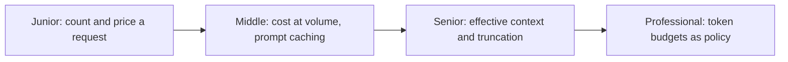

# Tokens and Context

> Tokens are what the model reads, writes, and what you pay for. The context window is the hard cap on how many it can handle at once. Both numbers drive cost, latency, and correctness.

## Levels

| Level | Guide | You are done when |
|---|---|---|
| Junior | [Count and price a request](junior.md) | You can count real tokens, compute a request's cost, and say what the context window caps. |
| Middle | [Cost at volume and caching](middle.md) | You can price a feature at real volume and use prompt caching to cut it. |
| Senior | [Effective context and truncation](senior.md) | You can diagnose degraded long-context answers and truncation bugs with evidence. |
| Professional | [Token budgets as policy](professional.md) | You can set token-budget standards and treat token growth as a tracked regression. |

## Practice rule

Never estimate tokens by eye. Every vendor ships a tokenizer or count endpoint — use the real one whenever the number drives a decision.

## Related

- [How LLMs Work](../how-llms-work/) — why the token is the unit of generation and billing.
- [Context Fundamentals](../../context-management/context-fundamentals/) — the production discipline of allocating the window.
