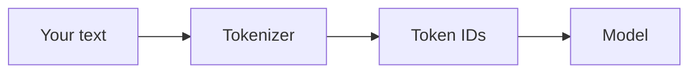

# Tokens and Context — Junior

<!-- level-focus -->
At junior level, focus on this question:

> Can you count a prompt's real tokens, compute what a request costs, and explain what the context window physically caps?

---

## Token ≠ word

- A **token** is a subword chunk — the unit the model reads, writes, and is billed in. Not a word, not a character.
- Rule of thumb for English prose: **~4 characters per token, or ~¾ of a word per token**. Planning estimate only.
- It breaks badly for: code, numbers, URLs, rare words, and non-English scripts (CJK text is often ~1–2 tokens per character — 3–6× the English ratio).

## Count for real

- Every vendor exposes exact counting: OpenAI's `tiktoken`, Anthropic's count-tokens API, Google's count-tokens endpoint, GLM similarly via its SDK.
- Use the *model's own* tokenizer — counts differ across vendors, and estimates lie precisely when it matters (long inputs, code, non-English).

## What you pay for

- **Input tokens**: your entire prompt — system prompt, history, tool results — before the model says anything.
- **Output tokens**: everything the model generates, including [reasoning tokens](../reasoning-models/) you may never see.
- **Cached-input tokens**: repeated prompt prefixes can be billed at a large discount (see [Middle](middle.md)).
- Cost = (input × input price) + (output × output price). Input is usually cheaper per token than output; a long system prompt paid on every call adds up.

## The context window is a hard cap

- The window is the max tokens (input + output combined, for most models) in one request. Exceed it and the request fails — or worse, your client truncates silently.
- Check both directions: does your input fit, and is there room left for the output you asked for?

## Common Mistakes

- **Estimating tokens by eye or word count.** Undercounts code and non-English by multiples — and cost estimates inherit the error.
- **Pricing only output tokens.** Input tokens recur on every call; in agent workflows they're usually the larger share.
- **Forgetting output room.** A 120k-token input into a 128k window leaves almost no room for an answer.
- **Using the wrong vendor's counter.** Roughly similar numbers, exactly wrong bills.

## Apply It

1. Take one real prompt, count its tokens with the actual model's tokenizer, and compute the request's cost from the vendor's price sheet.
2. Find your app's longest input and confirm it fits with output room to spare.
3. Identify the per-call fixed cost — the system prompt and other always-present tokens — you pay on every request.

## Verify Your Work

- Token counts come from the real tokenizer, not estimation.
- Cost math includes input and output, and names any cached discount.
- The context-window check covers input *and* output room.

## Review Questions

- Why does "4 characters per token" fail for CJK text, and what multiplier is more realistic?
- Why does input token cost often dominate an agent workflow's bill?
- What two things must fit in the context window, and what happens when input alone nearly fills it?
