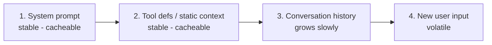

# Tokens and Context — Middle

<!-- level-focus -->
At middle level, focus on this question:

> Can you price a feature at real volume, explain why some inputs cost multiples more, and use prompt caching to cut the bill?

---

## Cost at volume — do the multiplication first

- Per-request cost looks trivial in a demo. Multiply by daily volume × 30 before choosing anything: 10k requests/day at $0.003 each is ~$900/month; at 10× the tokens, ~$9,000.
- The input side dominates for workflow apps: a 2k-token system prompt paid on 300k calls/month is 600M input tokens — regardless of how short your answers are.

## Why some text costs multiples more

- **Code**: symbols, indentation, and identifiers tokenize poorly — often 2–4× the tokens of similar-length prose.
- **Non-English**: CJK and non-Latin scripts often run 1–2 tokens per character vs. ~0.25 for English.
- **JSON/structured data**: braces, quotes, and repeated keys are token-expensive.
- Consequence: token estimates built on English prose systematically underprice real workloads. Measure with real samples.

## Prompt caching — the discount already available

- Providers bill repeated identical prompt prefixes (system prompt, tool definitions, long static context) at a steep discount when **cache hit** — often 50–90% off input price for the cached portion.
- Requirements: the prefix must be **byte-identical** across calls, and placed at the start of the prompt.
- Design consequence: put stable content first, volatile content (user message, fresh data) last. Reordering your prompt can silently void the cache.

## Common Mistakes

- **Judging affordability from one request's cost.** Volume is the whole game; always project monthly.
- **Underestimating via English-prose ratios.** Code-heavy and non-English workloads cost multiples of the naive estimate.
- **Breaking the cache without noticing.** A "harmless" prompt edit — timestamp injected mid-prefix, reordered fields — turns every call into full-price input.
- **Letting the system prompt bloat.** Every instruction added there is paid on every call; use prompt caching *and* ruthless editing together.

## Apply It

1. Price one feature at real volume: tokens/request (measured, not estimated) × daily volume × 30, input and output separately.
2. Sample your real inputs — including code and non-English cases — and compare actual token counts against the prose rule of thumb.
3. Restructure your prompt for caching: static prefix first, volatile content last; verify cache-hit behavior with your provider's usage fields.

## Verify Your Work

- Monthly cost projection uses measured tokens and separates input from output.
- Token-count estimates were checked against real non-prose samples.
- The prompt is ordered for caching, and cache hits are confirmed in usage data, not assumed.

## Review Questions

- Why is the input side usually the dominant cost in a workflow app?
- Why do code and CJK inputs cost multiples more than English prose of the same length?
- What two conditions must hold for prompt caching to apply, and what common edit silently voids it?
