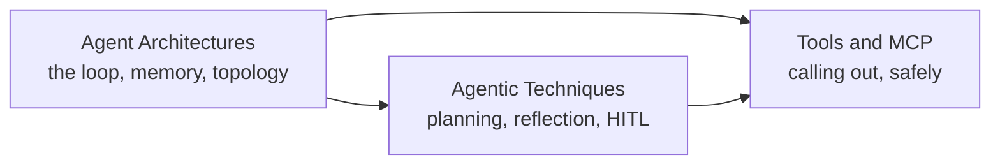

# AI Agent

> Build systems where an LLM doesn't just answer — it observes, decides, acts, and revises across a loop, using tools it can call and techniques that make that loop reliable.

An agent is only as good as the loop it runs (architecture), the discipline that loop follows under uncertainty (technique), and the actions it's actually allowed to take (tools). The three subtopics build on each other in that order — you can't reason about when to add a reflection step until you know what a loop iteration is, and you can't design a human-approval gate for a tool call until you know what calling a tool actually costs and risks.

## Topics

| # | Topic | What you'll learn |
|---|-------|-------------------|
| 01 | [Agent Architectures](agent-architectures/junior.md) | What turns a single LLM call into an agent — the observe-reason-act loop, single- vs multi-agent topology, memory, and stopping conditions. |
| 02 | [Agentic Techniques](agentic-techniques/junior.md) | Planning, reflection and self-correction, human-in-the-loop gates, and error recovery — the discipline layered on top of the loop. |
| 03 | [Tools and MCP](tools-and-mcp/junior.md) | Function/tool calling fundamentals, the Model Context Protocol, and the security boundary between an agent's reasoning and its real-world actions. |

## How to use this section

Each topic has four depth levels — **junior → middle → senior → professional**. Start at your level and climb. Agent Architectures is the foundation: it defines the loop, the memory model, and the failure modes (infinite loops, runaway tool calls, context exhaustion) that the other two topics assume you already recognize. Agentic Techniques is what you add to that loop to make it reliable under ambiguity — planning before acting, reflecting on a failed attempt, and stopping to ask a human before a high-stakes action. Tools and MCP is how the agent actually touches the outside world — defining what it's allowed to call, how it discovers what's callable at scale, and how you stop a compromised or malicious tool from turning an agent's mistake into real damage.

A running scenario threads through all three topics: an agent that handles inbound customer-support tickets — looking up orders, drafting replies, and eventually issuing refunds. It starts as a single-agent loop in Architectures, gains planning and an approval gate for refunds in Techniques, and gets its refund tool locked down with least-privilege scoping and audit logging in Tools and MCP. Following it end to end shows how the three topics compose into one system, not three unrelated skills.

For prompt design itself (how to phrase instructions, few-shot examples, structured output), see [Prompt Engineering](../llm-fundamentals/prompt-engineering/) in the LLM Fundamentals domain. For measuring whether an agent actually works — offline evals, regression suites, production observability — see [AI Evaluation](../ai-evaluation/).

---

> Part of the [Engineer Knowledge](../../README.md) roadmap.
