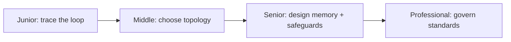
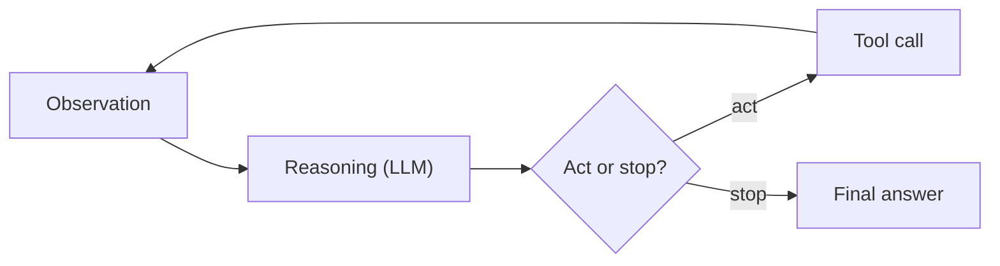

# Agent Architectures

> An agent is a loop, not a call: it observes, an LLM reasons about what to do, it acts, and it observes again — until a stopping condition says stop.

## Levels

| Level | Guide | You are done when |
|---|---|---|
| Junior | [Trace one loop iteration](junior.md) | You can walk through observe → reason → act → observe by hand for a simple task and explain why it's a loop, not a call. |
| Middle | [Choose single- vs multi-agent](middle.md) | You can justify an architecture choice against complexity, cost, and reliability, not preference. |
| Senior | [Design memory and safeguards](senior.md) | You can specify what persists across sessions, how it's retrieved, and what stops a runaway loop. |
| Professional | [Govern architecture standards](professional.md) | You can set org-wide rules for shared scaffolding, when multi-agent is justified, and who owns cost/reliability. |

## Practice rule

Before adding a second agent, a memory store, or a safeguard, write down the specific failure it prevents. An architecture decision that doesn't map to a named failure mode is speculation, not design.

## Related

- [Agentic Techniques](../agentic-techniques/) — the planning, reflection, and human-in-the-loop discipline layered on top of this loop.
- [Tools and MCP](../tools-and-mcp/) — what the "act" step actually calls, and how that call is secured.
- [AI Evaluation](../../ai-evaluation/) — measuring whether a given architecture actually performs better, not just looks more sophisticated.
